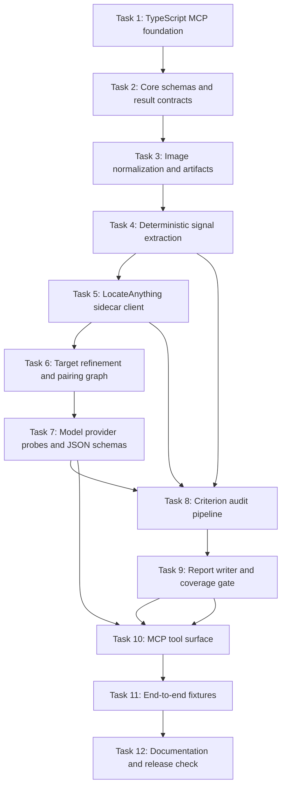

# UI Diff MCP MVP Implementation Plan

> **For agentic workers:** REQUIRED SUB-SKILL: Use superpowers:subagent-driven-development (recommended) or superpowers:executing-plans to implement this plan task-by-task. Steps use checkbox (`- [x]`) syntax for tracking.

**Goal:** Build the first usable `ui-diff-mcp` server that compares an expected mobile mockup image against an actual mobile screenshot and reports visible UI differences with locations, evidence, and artifacts.

**Architecture:** Use a TypeScript MCP server with a typed stage pipeline: image intake, normalization, deterministic signals, LocateAnything target localization, target pairing, criterion-scoped VLM audits, reviewer validation, coverage gate, and report writing. Keep every stage as a small pure module where possible so the pipeline can move to LangGraph later if resumable long-running runs become necessary.

**Tech Stack:** Node.js 22+, TypeScript ESM, `@modelcontextprotocol/sdk@1.29.0`, Zod v4, Sharp, PNGJS, pixelmatch, Vitest, OpenRouter Chat Completions, `nvidia/LocateAnything-3B` through a sidecar HTTP API, optional NVIDIA OpenAI-compatible VLM endpoint.

---

## Research Inputs

- MCP TypeScript SDK v1.29.0 is the production SDK line as of 2026-06-12; use `@modelcontextprotocol/sdk/server/mcp.js` and `@modelcontextprotocol/sdk/server/stdio.js`, not the v2 alpha split packages.
- MCP tools that declare output schemas must return matching structured content. The server should validate all tool arguments with Zod and should avoid broad filesystem or command-execution tools.
- Sharp supports metadata reads, EXIF-aware rotation, resizing, raw pixel buffers, crop extraction, and compositing. Use it for all image normalization and artifact generation.
- pixelmatch gives a fast changed-pixel mask with anti-alias handling. Treat it as a coverage signal, not a visual-diff judge.
- OpenRouter supports image inputs through Chat Completions multipart content and structured outputs through `response_format: { type: "json_schema" }` for compatible models. Still validate locally with Zod.
- `nvidia/LocateAnything-3B` is the selected locator because its model card names GUI element grounding, OCR localization, dense detection, and box output. The TypeScript server talks to it through the sidecar contract from the approved spec.
- Model defaults from the approved spec remain fixed: locator `nvidia/LocateAnything-3B`, auditor `qwen/qwen3-vl-30b-a3b-instruct`, fast auditor `qwen/qwen3-vl-8b-instruct`, reviewer `google/gemini-2.5-flash-lite`, escalation `qwen/qwen3-vl-235b-a22b-instruct`, free-only mode `nex-agi/nex-n2-pro:free` plus `nvidia/nemotron-nano-12b-v2-vl:free`.

Sources: [MCP TypeScript SDK](https://github.com/modelcontextprotocol/typescript-sdk), [MCP security best practices](https://modelcontextprotocol.io/docs/tutorials/security/security_best_practices), [Sharp docs](https://sharp.pixelplumbing.com/), [pixelmatch](https://github.com/mapbox/pixelmatch), [OpenRouter structured outputs](https://openrouter.ai/docs/guides/features/structured-outputs), [OpenRouter image inputs](https://openrouter.ai/docs/guides/overview/multimodal/image-understanding), [LocateAnything-3B](https://huggingface.co/nvidia/LocateAnything-3B), [NVIDIA NIM VLM structured generation](https://docs.nvidia.com/nim/vision-language-models/1.0.0/structured-generation.html).

## Implementation Flow

Diagram source: `docs/architecture/diagrams/implementation-plan-flow.mmd`



## File Structure

- Create `package.json`: npm scripts and pinned runtime dependencies.
- Create `package-lock.json`: generated by `npm install`.
- Create `tsconfig.json`: strict NodeNext TypeScript build.
- Create `vitest.config.ts`: Node test environment and coverage target.
- Create `src/index.ts`: MCP stdio entrypoint.
- Create `src/server.ts`: tool registration.
- Create `src/pipeline/run-ui-diff.ts`: top-level stage orchestration.
- Create `src/pipeline/stages.ts`: stage interfaces and timing metadata.
- Create `src/schemas/core.ts`: shared Zod schemas for images, boxes, elements, criteria, diffs, reports, model health, and MCP outputs.
- Create `src/schemas/tool-schemas.ts`: input/output schemas for MCP tools.
- Create `src/images/normalize.ts`: image validation, orientation, sizing, color normalization, and raw RGBA loading.
- Create `src/images/artifacts.ts`: artifact directory creation, crop writing, overlay writing, and JSON-safe path recording.
- Create `src/signals/pixel-diff.ts`: pixelmatch masks and connected changed-pixel components.
- Create `src/signals/geometry.ts`: box math, IoU, containment, spacing, alignment, and normalized coordinate helpers.
- Create `src/signals/color.ts`: sampled color statistics inside boxes.
- Create `src/signals/edge.ts`: simple edge mask extraction from normalized RGBA buffers.
- Create `src/locator/locateanything-client.ts`: sidecar HTTP client and response validation.
- Create `src/locator/element-map.ts`: duplicate merging, snapping, hierarchy, and stable element IDs.
- Create `src/pairing/pair-elements.ts`: expected-to-actual target pairing graph.
- Create `src/models/model-registry.ts`: fixed model roles, provider IDs, and probe TTL policy.
- Create `src/models/openrouter-client.ts`: OpenRouter image+JSON request adapter.
- Create `src/models/nvidia-client.ts`: optional NVIDIA OpenAI-compatible request adapter.
- Create `src/models/probes.ts`: health probes for image input, strict JSON, known fixture, timeout, and expected/actual order.
- Create `src/audit/criteria.ts`: built-in UI criteria and deterministic trigger rules.
- Create `src/audit/prompts.ts`: narrow prompts for locator, criterion auditor, reviewer, and escalation.
- Create `src/audit/audit-target.ts`: criterion-scoped VLM call construction and response validation.
- Create `src/audit/review-findings.ts`: reviewer pass and duplicate merge.
- Create `src/report/coverage.ts`: assignment of changed-pixel components to diff records and `unclassified_visual_change` records.
- Create `src/report/report-writer.ts`: `report.json`, compact MCP result, and artifact index.
- Create `src/security/paths.ts`: path resolution, allowed extensions, project-local run directory creation, and traversal checks.
- Create `src/capture/mobile-capture.ts`: narrow optional screenshot capture API using explicit commands only.
- Create `src/testing/fixture-images.ts`: generated PNG fixtures for tests.
- Create tests under `tests/unit/**/*.test.ts` and `tests/e2e/**/*.test.ts`.
- Create `examples/compare-images.json`: example tool payload.
- Modify `README.md`: install, run, environment variables, model choices, no manual target maps.

## Task 1: TypeScript MCP Foundation

**Files:**
- Create: `package.json`
- Create: `tsconfig.json`
- Create: `vitest.config.ts`
- Create: `src/index.ts`
- Create: `src/server.ts`
- Test: `tests/unit/server.test.ts`

- [x] **Step 1: Create package metadata and scripts**

Use this `package.json`:

```json
{
  "name": "ui-diff-mcp",
  "version": "0.1.0",
  "private": true,
  "type": "module",
  "bin": {
    "ui-diff-mcp": "./dist/index.js"
  },
  "scripts": {
    "build": "tsc -p tsconfig.json",
    "typecheck": "tsc -p tsconfig.json --noEmit",
    "test": "vitest run",
    "test:watch": "vitest",
    "test:coverage": "vitest run --coverage",
    "start": "node dist/index.js",
    "verify": "npm run typecheck && npm test && npm run build"
  },
  "dependencies": {
    "@modelcontextprotocol/sdk": "1.29.0",
    "pixelmatch": "7.2.0",
    "pngjs": "7.0.0",
    "sharp": "0.35.1",
    "zod": "4.4.3"
  },
  "devDependencies": {
    "@types/pixelmatch": "5.2.6",
    "@types/node": "^22.19.0",
    "@types/pngjs": "^6.0.5",
    "@vitest/coverage-v8": "4.1.8",
    "tsx": "^4.21.0",
    "typescript": "^5.9.0",
    "vitest": "4.1.8"
  },
  "engines": {
    "node": ">=22.0.0"
  }
}
```

- [x] **Step 2: Install dependencies**

Run: `npm install`

Expected: `package-lock.json` is created and `npm audit` summary contains no critical vulnerability.

- [x] **Step 3: Create strict TypeScript settings**

Use this `tsconfig.json`:

```json
{
  "compilerOptions": {
    "target": "ES2022",
    "module": "NodeNext",
    "moduleResolution": "NodeNext",
    "lib": ["ES2022"],
    "strict": true,
    "noUncheckedIndexedAccess": true,
    "exactOptionalPropertyTypes": true,
    "esModuleInterop": true,
    "forceConsistentCasingInFileNames": true,
    "skipLibCheck": true,
    "outDir": "dist",
    "rootDir": ".",
    "types": ["node", "vitest"]
  },
  "include": ["src/**/*.ts", "tests/**/*.ts", "vitest.config.ts"],
  "exclude": ["node_modules", "dist", "coverage", ".ui-diff"]
}
```

- [x] **Step 4: Create Vitest settings**

Use this `vitest.config.ts`:

```ts
import { defineConfig } from "vitest/config";

export default defineConfig({
  test: {
    environment: "node",
    include: ["tests/**/*.test.ts"],
    coverage: {
      provider: "v8",
      reporter: ["text", "lcov"],
      include: ["src/**/*.ts"],
      exclude: ["src/index.ts"]
    }
  }
});
```

- [x] **Step 5: Create server entrypoint**

Use this `src/index.ts`:

```ts
import { StdioServerTransport } from "@modelcontextprotocol/sdk/server/stdio.js";
import { createServer } from "./server.js";

const server = createServer();
const transport = new StdioServerTransport();

await server.connect(transport);
```

- [x] **Step 6: Create empty tool registry**

Use this `src/server.ts`:

```ts
import { McpServer } from "@modelcontextprotocol/sdk/server/mcp.js";

export function createServer(): McpServer {
  return new McpServer({
    name: "ui-diff-mcp",
    version: "0.1.0"
  });
}
```

- [x] **Step 7: Add foundation test**

Use this `tests/unit/server.test.ts`:

```ts
import { describe, expect, it } from "vitest";
import { createServer } from "../../src/server.js";

describe("createServer", () => {
  it("creates an MCP server instance", () => {
    const server = createServer();
    expect(server).toBeTruthy();
  });
});
```

- [x] **Step 8: Verify and commit**

Run: `npm run verify`

Expected: TypeScript, tests, and build all pass.

Commit and push:

```bash
git add package.json package-lock.json tsconfig.json vitest.config.ts src/index.ts src/server.ts tests/unit/server.test.ts
git commit -m "feat: bootstrap ui diff mcp server"
git push
```

## Task 2: Core Schemas And Contracts

**Files:**
- Create: `src/schemas/core.ts`
- Create: `src/schemas/tool-schemas.ts`
- Test: `tests/unit/schemas.test.ts`

- [x] **Step 1: Define shared schemas**

Create `src/schemas/core.ts` with these exported Zod schemas and inferred types:

```ts
import { z } from "zod";

export const BoxSchema = z.object({
  x: z.number().finite().min(0),
  y: z.number().finite().min(0),
  width: z.number().finite().positive(),
  height: z.number().finite().positive()
});
export type Box = z.infer<typeof BoxSchema>;

export const NormalizedBoxSchema = z.object({
  x: z.number().finite().min(0).max(1),
  y: z.number().finite().min(0).max(1),
  width: z.number().finite().positive().max(1),
  height: z.number().finite().positive().max(1)
});
export type NormalizedBox = z.infer<typeof NormalizedBoxSchema>;

export const UiElementTypeSchema = z.enum([
  "text",
  "button",
  "card",
  "image",
  "icon",
  "chart",
  "nav",
  "list_item",
  "unknown"
]);
export type UiElementType = z.infer<typeof UiElementTypeSchema>;

export const UiCriterionSchema = z.enum([
  "presence",
  "geometry",
  "spacing_alignment",
  "typography_content",
  "color_appearance",
  "icon_image",
  "layering_clipping",
  "component_state",
  "chart_special_geometry",
  "unclassified_visual_change"
]);
export type UiCriterion = z.infer<typeof UiCriterionSchema>;

export const UiElementSchema = z.object({
  id: z.string().min(1),
  label: z.string().min(1),
  type: UiElementTypeSchema,
  box: BoxSchema,
  normalizedBox: NormalizedBoxSchema,
  text: z.string().optional(),
  confidence: z.number().finite().min(0).max(1),
  source: z.enum(["locator", "ocr", "deterministic", "merged"]),
  parentId: z.string().optional(),
  childIds: z.array(z.string()).default([])
});
export type UiElement = z.infer<typeof UiElementSchema>;

export const PairingStatusSchema = z.enum(["matched", "missing", "extra", "uncertain"]);
export type PairingStatus = z.infer<typeof PairingStatusSchema>;

export const ElementPairSchema = z.object({
  id: z.string().min(1),
  expectedId: z.string().optional(),
  actualId: z.string().optional(),
  status: PairingStatusSchema,
  score: z.number().finite().min(0).max(1),
  reasons: z.array(z.string()).default([])
});
export type ElementPair = z.infer<typeof ElementPairSchema>;

export const DeterministicMeasurementSchema = z.object({
  name: z.string().min(1),
  value: z.union([z.number(), z.string(), z.boolean()]),
  unit: z.string().optional()
});
export type DeterministicMeasurement = z.infer<typeof DeterministicMeasurementSchema>;

export const DiffRecordSchema = z.object({
  id: z.string().min(1),
  pairId: z.string().optional(),
  criterion: UiCriterionSchema,
  severity: z.enum(["low", "medium", "high"]),
  title: z.string().min(1),
  location: BoxSchema,
  evidence: z.array(z.string().min(1)).min(1),
  measurements: z.array(DeterministicMeasurementSchema).default([]),
  artifactPaths: z.array(z.string().min(1)).default([]),
  reviewerStatus: z.enum(["accepted", "rejected", "needs_escalation", "not_reviewed"]),
  model: z.string().optional()
});
export type DiffRecord = z.infer<typeof DiffRecordSchema>;

export const RunStatusSchema = z.enum(["complete", "incomplete", "model_unavailable", "failed"]);
export type RunStatus = z.infer<typeof RunStatusSchema>;

export const VisualClassificationStatusSchema = z.enum(["complete", "incomplete", "not_run"]);
export type VisualClassificationStatus = z.infer<typeof VisualClassificationStatusSchema>;

export const UiDiffReportSchema = z.object({
  schemaVersion: z.literal("0.1"),
  runId: z.string().min(1),
  createdAt: z.string().datetime(),
  status: RunStatusSchema,
  visualClassificationStatus: VisualClassificationStatusSchema,
  expectedImagePath: z.string().min(1),
  actualImagePath: z.string().min(1),
  artifactRoot: z.string().min(1),
  elements: z.object({
    expected: z.array(UiElementSchema),
    actual: z.array(UiElementSchema)
  }),
  pairs: z.array(ElementPairSchema),
  diffs: z.array(DiffRecordSchema),
  modelHealth: z.array(z.object({
    role: z.string().min(1),
    provider: z.string().min(1),
    model: z.string().min(1),
    status: z.enum(["pass", "fail", "not_checked"]),
    checkedAt: z.string().datetime(),
    detail: z.string().optional()
  })),
  warnings: z.array(z.string()).default([])
});
export type UiDiffReport = z.infer<typeof UiDiffReportSchema>;
```

- [x] **Step 2: Define MCP tool schemas**

Create `src/schemas/tool-schemas.ts`:

```ts
import { z } from "zod";
import { RunStatusSchema } from "./core.js";

export const CompareUiImagesInputSchema = {
  expectedImagePath: z.string().min(1),
  actualImagePath: z.string().min(1),
  projectRoot: z.string().min(1).optional(),
  runLabel: z.string().min(1).max(80).optional(),
  mode: z.enum(["full", "deterministic_only", "free_only"]).default("full")
};

export const CompareUiImagesOutputSchema = {
  runId: z.string().min(1),
  status: RunStatusSchema,
  diffCount: z.number().int().min(0),
  reportPath: z.string().min(1),
  artifactRoot: z.string().min(1),
  summary: z.string().min(1),
  warnings: z.array(z.string()).default([])
};

export const ModelHealthOutputSchema = {
  checkedAt: z.string().datetime(),
  results: z.array(z.object({
    role: z.string().min(1),
    provider: z.string().min(1),
    model: z.string().min(1),
    status: z.enum(["pass", "fail", "not_checked"]),
    detail: z.string().optional()
  }))
};
```

- [x] **Step 3: Add schema tests**

Use this `tests/unit/schemas.test.ts`:

```ts
import { describe, expect, it } from "vitest";
import { DiffRecordSchema, UiDiffReportSchema } from "../../src/schemas/core.js";

describe("core schemas", () => {
  it("accepts a visible diff record with evidence", () => {
    const parsed = DiffRecordSchema.parse({
      id: "diff-1",
      criterion: "geometry",
      severity: "high",
      title: "Button is lower than expected",
      location: { x: 10, y: 20, width: 100, height: 44 },
      evidence: ["actual y=20, expected y=12"],
      reviewerStatus: "accepted"
    });
    expect(parsed.criterion).toBe("geometry");
  });

  it("rejects a report without evidence-backed diffs", () => {
    expect(() => UiDiffReportSchema.parse({
      schemaVersion: "0.1",
      runId: "run-1",
      createdAt: new Date().toISOString(),
      status: "complete",
      visualClassificationStatus: "complete",
      expectedImagePath: "expected.png",
      actualImagePath: "actual.png",
      artifactRoot: ".ui-diff/runs/run-1/artifacts",
      elements: { expected: [], actual: [] },
      pairs: [],
      diffs: [{
        id: "bad",
        criterion: "presence",
        severity: "low",
        title: "Bad",
        location: { x: 0, y: 0, width: 1, height: 1 },
        evidence: [],
        reviewerStatus: "accepted"
      }],
      modelHealth: []
    })).toThrow();
  });
});
```

- [x] **Step 4: Verify and commit**

Run: `npm run verify`

Expected: all schema tests pass.

Commit and push:

```bash
git add src/schemas tests/unit/schemas.test.ts
git commit -m "feat: define ui diff schemas"
git push
```

## Task 3: Image Normalization And Artifacts

**Files:**
- Create: `src/security/paths.ts`
- Create: `src/images/normalize.ts`
- Create: `src/images/artifacts.ts`
- Create: `src/testing/fixture-images.ts`
- Test: `tests/unit/images.test.ts`

- [x] **Step 1: Create safe path helpers**

Implement `resolveInputImagePath`, `createRunDirectory`, and `assertSupportedImagePath` in `src/security/paths.ts`. Supported extensions are `.png`, `.jpg`, `.jpeg`, and `.webp`. Resolve all paths to absolute paths and reject paths containing null bytes or unsupported extensions.

```ts
export const SUPPORTED_IMAGE_EXTENSIONS = new Set([".png", ".jpg", ".jpeg", ".webp"]);
```

- [x] **Step 2: Create fixture image generator**

Implement `writeSolidPng`, `writeRectPng`, and `writeTwoButtonFixture` in `src/testing/fixture-images.ts` using Sharp. The functions write deterministic PNGs into a caller-provided directory.

- [x] **Step 3: Create normalization module**

Implement `loadNormalizedImage(inputPath, outputPath, targetSize?)` in `src/images/normalize.ts`. It must:

- read metadata with Sharp,
- apply `rotate()` to honor image orientation,
- convert to sRGB,
- resize only when `targetSize` is supplied,
- write a PNG artifact,
- return `{ path, width, height, channels, rgba }`.

- [x] **Step 4: Create artifact module**

Implement `writeCrop`, `writeOverlay`, and `writeJsonArtifact` in `src/images/artifacts.ts`. `writeCrop` must clamp only after its caller has validated the box against image bounds; invalid boxes throw before Sharp extraction.

- [x] **Step 5: Add image tests**

Use tests that generate a 100x100 fixture, normalize it, assert width/height/channels, crop a 40x40 rectangle, and assert unsupported extensions are rejected.

- [x] **Step 6: Verify and commit**

Run: `npm run verify`

Expected: image tests pass and no `.ui-diff` run artifacts are staged.

Commit and push:

```bash
git add src/security src/images src/testing tests/unit/images.test.ts
git commit -m "feat: add image normalization artifacts"
git push
```

## Task 4: Deterministic Signal Extraction

**Files:**
- Create: `src/signals/geometry.ts`
- Create: `src/signals/pixel-diff.ts`
- Create: `src/signals/color.ts`
- Create: `src/signals/edge.ts`
- Test: `tests/unit/signals.test.ts`

- [x] **Step 1: Implement box math**

In `src/signals/geometry.ts`, implement `area`, `intersect`, `iou`, `toNormalizedBox`, `fromNormalizedBox`, `containsCenter`, and `expandBox`. Unit tests must include partial overlap, no overlap, and exact overlap.

- [x] **Step 2: Implement pixel diff mask**

In `src/signals/pixel-diff.ts`, use `PNG.sync.read` and `pixelmatch` to create a diff PNG plus connected components. Return changed pixel count, changed percent, and components with pixel boxes and area.

- [x] **Step 3: Implement color samples**

In `src/signals/color.ts`, sample average RGBA and dominant simple palette inside a box. Use deterministic integer rounding.

- [x] **Step 4: Implement edge mask**

In `src/signals/edge.ts`, implement a simple grayscale Sobel edge detector over RGBA buffers and return edge components above a threshold.

- [x] **Step 5: Add signal tests**

Generate two 100x100 images where the actual image shifts a red rectangle by 10px. Assert pixel diff detects at least two components, IoU is below 1, and color sampling sees red inside the expected rectangle.

- [x] **Step 6: Verify and commit**

Run: `npm run verify`

Expected: deterministic signal tests pass.

Commit and push:

```bash
git add src/signals tests/unit/signals.test.ts
git commit -m "feat: extract deterministic visual signals"
git push
```

## Task 5: LocateAnything Sidecar Client

**Files:**
- Create: `src/locator/locateanything-client.ts`
- Test: `tests/unit/locateanything-client.test.ts`

- [x] **Step 1: Implement sidecar schemas**

Define request and response Zod schemas that exactly match the approved contract:

```ts
export const LocateAnythingRequestSchema = z.object({
  imagePath: z.string().min(1),
  queries: z.array(z.object({
    id: z.string().min(1),
    prompt: z.string().min(1)
  })).min(1),
  generationMode: z.enum(["detection", "grounding", "hybrid"]).default("hybrid"),
  maxBoxesPerQuery: z.number().int().positive().max(500).default(200)
});
```

The response schema must include `model`, `image.width`, `image.height`, `elements[].queryId`, `elements[].label`, `elements[].box`, `elements[].rawBox1000`, `elements[].confidence`, `elements[].rawText`, and `warnings`.

- [x] **Step 2: Implement HTTP client**

Implement `locateUiElements({ endpoint, request, timeoutMs })`. Use `AbortSignal.timeout(timeoutMs)`, POST JSON to `/v1/locate-ui-elements`, parse JSON, reject non-2xx responses with a typed `LocatorUnavailableError`, and reject boxes that exceed image bounds.

- [x] **Step 3: Add sidecar client tests**

Use a local `node:http` test server. Test one valid response, one out-of-bounds box rejection, and one HTTP 503 response that becomes `LocatorUnavailableError` with code `locator_unavailable`.

- [x] **Step 4: Verify and commit**

Run: `npm run verify`

Expected: sidecar client tests pass without contacting any external model.

Commit and push:

```bash
git add src/locator/locateanything-client.ts tests/unit/locateanything-client.test.ts
git commit -m "feat: add locateanything sidecar client"
git push
```

## Task 6: Target Refinement And Pairing Graph

**Files:**
- Create: `src/locator/element-map.ts`
- Create: `src/pairing/pair-elements.ts`
- Test: `tests/unit/element-map.test.ts`
- Test: `tests/unit/pair-elements.test.ts`

- [x] **Step 1: Implement element map creation**

Implement `buildElementMap(rawElements, imageSize, deterministicBoxes)`. It must convert sidecar elements into `UiElement` records, merge duplicates with IoU >= 0.82, create stable IDs from type/label/box hash, and keep parent/child relations when one box contains another.

- [x] **Step 2: Implement box snapping**

Add `snapElementBoxesToSignals(elements, edgeComponents, textBoxes)`. A raw element box can snap to a deterministic box only when IoU >= 0.55 or when the deterministic box center is inside the raw box and area ratio is between 0.35 and 2.2. Record a warning when a box changes by more than 12px.

- [x] **Step 3: Implement pairing**

Implement `pairElements(expectedElements, actualElements)`. Score candidates using normalized weighted terms:

```text
0.45 geometry + 0.25 text + 0.20 type + 0.10 hierarchy
```

Create `matched` pairs at score >= 0.62, `uncertain` pairs at score >= 0.45, `missing` for unpaired expected elements, and `extra` for unpaired actual elements.

- [x] **Step 4: Add pairing tests**

Test a shifted button pair, a missing expected label, an extra actual icon, and two duplicate locator boxes that merge into one element.

- [x] **Step 5: Verify and commit**

Run: `npm run verify`

Expected: element map and pairing tests pass.

Commit and push:

```bash
git add src/locator/element-map.ts src/pairing tests/unit/element-map.test.ts tests/unit/pair-elements.test.ts
git commit -m "feat: pair discovered ui elements"
git push
```

## Task 7: Model Provider Probes And JSON Schemas

**Files:**
- Create: `src/models/model-registry.ts`
- Create: `src/models/openrouter-client.ts`
- Create: `src/models/nvidia-client.ts`
- Create: `src/models/probes.ts`
- Test: `tests/unit/model-registry.test.ts`
- Test: `tests/unit/model-clients.test.ts`

- [x] **Step 1: Implement fixed model registry**

Define model roles with exact IDs from the approved spec. Do not auto-substitute models. Store probe TTLs as 15 minutes for free-only models and 24 hours for pinned paid/local models.

- [x] **Step 2: Implement OpenRouter adapter**

Implement `callOpenRouterVisionJson({ apiKey, model, prompt, images, jsonSchema, timeoutMs })`. Send multipart message content with text first and `image_url` data URLs after it. Use `response_format: { type: "json_schema", json_schema: { name, strict: true, schema } }`. Return raw provider metadata and parsed JSON.

- [x] **Step 3: Implement NVIDIA adapter**

Implement the same interface for an OpenAI-compatible NVIDIA endpoint. Use `NVIDIA_API_KEY` and `NVIDIA_VLM_BASE_URL`. Keep this adapter optional; absence of environment variables reports `not_checked`.

- [x] **Step 4: Implement probes**

Create probes that generate a 64x64 blue PNG and a 100x100 red-rectangle PNG. Probe image input, JSON schema compliance, known-color reading, known box reading, timeout behavior, and expected/actual ordering. A failed probe excludes that model for the current run and returns `model_unavailable` if no required model remains.

- [x] **Step 5: Add provider tests with mocked fetch**

Mock `globalThis.fetch` and test: OpenRouter request shape, JSON schema payload, data URL image ordering, failed HTTP status, malformed JSON, and missing API key status.

- [x] **Step 6: Verify and commit**

Run: `npm run verify`

Expected: model tests pass without live API calls.

Commit and push:

```bash
git add src/models tests/unit/model-registry.test.ts tests/unit/model-clients.test.ts
git commit -m "feat: add visual model probes"
git push
```

## Task 8: Criterion Audit Pipeline

**Files:**
- Create: `src/audit/criteria.ts`
- Create: `src/audit/prompts.ts`
- Create: `src/audit/audit-target.ts`
- Create: `src/audit/review-findings.ts`
- Test: `tests/unit/audit.test.ts`

- [x] **Step 1: Implement built-in criteria**

Create one rubric object per criterion: presence, geometry, spacing/alignment, typography/content, color/appearance, icon/image, layering/clipping, component state, chart/special geometry, and unclassified visual change. Each rubric must produce a JSON-only audit result with `hasDiff`, `severity`, `title`, `evidence`, and `measurements`.

- [x] **Step 2: Implement deterministic criterion triggers**

Map measurements to criteria: unmatched pair triggers presence; box delta triggers geometry; gap/baseline delta triggers spacing/alignment; OCR delta triggers typography/content; color sample delta triggers color/appearance; edge/crop mismatch in icon/image boxes triggers icon/image; overlap/clipping triggers layering/clipping; state words and selected/nav pairs trigger component state; chart type plus edge/pixel mismatch triggers chart/special geometry.

- [x] **Step 3: Implement prompt builders**

Prompts must forbid causality explanations and implementation recommendations. The auditor prompt sees expected crop, actual crop, local overlay, target metadata, one criterion, deterministic measurements, and strict JSON schema. The reviewer prompt can accept, reject, or mark needs escalation based only on supplied evidence.

- [x] **Step 4: Implement audit orchestration**

Implement `auditElementPair(pair, context)`. It writes crops and overlay artifacts, selects criteria, calls the auditor model for each triggered criterion, validates JSON, calls the reviewer, and returns accepted diff records plus rejected records in debug metadata.

- [x] **Step 5: Add audit tests**

Mock model calls. Test that a shifted button triggers geometry only, a changed label triggers typography/content, a reviewer rejection removes a diff from final records, and prompt text contains no code-edit advice section.

- [x] **Step 6: Verify and commit**

Run: `npm run verify`

Expected: audit tests pass and prompt snapshot changes are intentional.

Commit and push:

```bash
git add src/audit tests/unit/audit.test.ts
git commit -m "feat: audit ui targets by criterion"
git push
```

## Task 9: Report Writer And Coverage Gate

**Files:**
- Create: `src/report/coverage.ts`
- Create: `src/report/report-writer.ts`
- Test: `tests/unit/report.test.ts`

- [x] **Step 1: Implement coverage assignment**

Implement `assignDiffComponentsToRecords(components, diffs, minArea)`. Every changed-pixel component with area >= `minArea` must either overlap a diff location or become a new `unclassified_visual_change` diff record with artifact evidence.

- [x] **Step 2: Implement report writer**

Implement `writeUiDiffReport(reportDraft)`. It writes `report.json`, `artifacts/index.json`, compact summary fields, and paths relative to the run root where possible.

- [x] **Step 3: Add report tests**

Test that uncovered components produce `unclassified_visual_change`, report JSON validates with `UiDiffReportSchema`, and compact output contains `runId`, `status`, `diffCount`, `reportPath`, and `artifactRoot`.

- [x] **Step 4: Verify and commit**

Run: `npm run verify`

Expected: report tests pass.

Commit and push:

```bash
git add src/report tests/unit/report.test.ts
git commit -m "feat: write coverage checked ui diff reports"
git push
```

## Task 10: MCP Tool Surface

**Files:**
- Modify: `src/server.ts`
- Create: `src/pipeline/stages.ts`
- Create: `src/pipeline/run-ui-diff.ts`
- Create: `src/capture/mobile-capture.ts`
- Test: `tests/unit/tools.test.ts`

- [x] **Step 1: Implement pipeline orchestration**

Implement `runUiDiff(input)` in `src/pipeline/run-ui-diff.ts`. The sequence is exactly: resolve paths, create run directory, normalize images, extract deterministic signals, call locator, build element maps, pair elements, probe required models, audit pairs, run coverage gate, write report, return compact output.

- [x] **Step 2: Implement stage timing metadata**

Add `StageResult<T>` in `src/pipeline/stages.ts` with `name`, `startedAt`, `completedAt`, `durationMs`, `warnings`, and `data`. Include stage timings in `report.json`.

- [x] **Step 3: Register MCP tools**

Modify `src/server.ts` to register:

- `compare_ui_images`
- `discover_ui_diffs`
- `ui_diff_model_health`
- `read_ui_diff_report`
- `capture_mobile_screen`

Each tool must declare Zod input and output schemas. Each non-error response must return both `content` and `structuredContent`.

- [x] **Step 4: Implement narrow capture**

Implement `capture_mobile_screen` only for explicit supported targets: `adb` and `ios-simctl`. Use `execFile` or `spawn` with argument arrays through `node:child_process`, never shell strings. If the required executable is absent, return a structured error.

- [x] **Step 5: Add tool tests**

Mock `runUiDiff` and assert `compare_ui_images` returns structured content. Test that `read_ui_diff_report` reads only a validated report path and that capture rejects unknown target kinds.

- [x] **Step 6: Verify and commit**

Run: `npm run verify`

Expected: tools register and tests pass.

Commit and push:

```bash
git add src/server.ts src/pipeline src/capture tests/unit/tools.test.ts
git commit -m "feat: expose ui diff mcp tools"
git push
```

## Task 11: End-To-End Fixtures

**Files:**
- Create: `tests/e2e/compare-ui-images.test.ts`
- Create: `tests/fixtures/mock-sidecar.ts`
- Create: `tests/fixtures/mock-models.ts`
- Create: `examples/compare-images.json`

- [x] **Step 1: Create fixture sidecar**

Implement a local HTTP sidecar fixture that returns text, button, card, icon, and chart boxes for generated expected and actual screenshots.

- [x] **Step 2: Create fixture models**

Implement mocked auditor and reviewer responses. The fixture must produce one geometry diff, one typography/content diff, one extra element diff, and one uncovered component that becomes `unclassified_visual_change`.

- [x] **Step 3: Add end-to-end test**

Run the full pipeline against generated screenshots. Assert `status === "complete"`, `diffCount === 4`, report exists, normalized images exist, crop artifacts exist, overlay exists, and every diff has location and evidence.

- [x] **Step 4: Add example payload**

Create `examples/compare-images.json`:

```json
{
  "expectedImagePath": "C:/absolute/path/to/mockup.png",
  "actualImagePath": "C:/absolute/path/to/screenshot.png",
  "mode": "full"
}
```

- [x] **Step 5: Verify and commit**

Run: `npm run verify`

Expected: all unit and end-to-end tests pass.

Commit and push:

```bash
git add tests/e2e tests/fixtures examples/compare-images.json
git commit -m "test: add ui diff end to end fixtures"
git push
```

## Task 12: Documentation And Release Check

**Files:**
- Modify: `README.md`
- Create: `.env.example`
- Modify: `.gitignore` if new local artifacts appear during implementation.

- [x] **Step 1: Document install and run**

Update `README.md` with:

- `npm install`
- `npm run verify`
- `npm run build`
- MCP command: `node C:/Users/xursc/projects/ui-diff-mcp/dist/index.js`
- required environment variables: `OPENROUTER_API_KEY`
- optional environment variables: `LOCATEANYTHING_SIDECAR_URL`, `NVIDIA_API_KEY`, `NVIDIA_VLM_BASE_URL`
- first Calorix use case paths
- statement that no user-authored target map, ROI map, ignore mask, or anchor dump is required.

- [x] **Step 2: Add environment example**

Create `.env.example` with variable names and empty values only:

```text
OPENROUTER_API_KEY=
LOCATEANYTHING_SIDECAR_URL=http://127.0.0.1:39731
NVIDIA_API_KEY=
NVIDIA_VLM_BASE_URL=
```

- [x] **Step 3: Run final verification**

Run:

```bash
npm run verify
git diff --check
git status --short
```

Expected: verify passes, `git diff --check` prints no whitespace errors, and only intentional docs/example files are unstaged before committing.

- [x] **Step 4: Commit and push**

Commit and push:

```bash
git add README.md .env.example .gitignore
git commit -m "docs: document ui diff mcp setup"
git push
```

## Acceptance Checks

- `npm run verify` passes on a clean checkout.
- `compare_ui_images` returns structured content and writes `report.json`.
- The report contains normalized images, pixel diff artifacts, target crops, overlays, element maps, pairing graph, model health, and diff records.
- Every meaningful changed-pixel component is assigned to a target diff or reported as `unclassified_visual_change`.
- No generated report contains causality explanations, app-edit recommendations, MCP-edit recommendations, or acceptance language about app correctness.
- The default implementation requires no user-authored screen target maps, ROI maps, ignore masks, or Flutter anchor dumps.
- A missing or failing VLM provider returns deterministic artifacts with `status: "model_unavailable"` or `status: "incomplete"` and `visualClassificationStatus: "incomplete"` instead of presenting a complete visual audit.
- Every repository change is committed and pushed to `origin` after the task that made it.

## Gemini Review

Gemini 3 Pro Preview review pass 1:

- `AGREEMENT_STATUS: agree`
- Must-fix: add `@vitest/coverage-v8` because the plan enables V8 coverage; add `@types/pixelmatch` because pixelmatch does not ship its own TypeScript declarations.
- Should-fix: use real Node child-process API names in the capture step; add explicit `visualClassificationStatus` to match the approved spec wording.

Changes incorporated:

- Added `@vitest/coverage-v8@4.1.8`.
- Added `@types/pixelmatch@5.2.6`.
- Added `VisualClassificationStatusSchema` and `visualClassificationStatus` to the report schema/test fixture.
- Updated the capture step to use `execFile` or `spawn` with argument arrays.

Gemini 3 Pro Preview final blocker-only pass:

- `AGREEMENT_STATUS: agree`
- `MUST_FIX: none`
