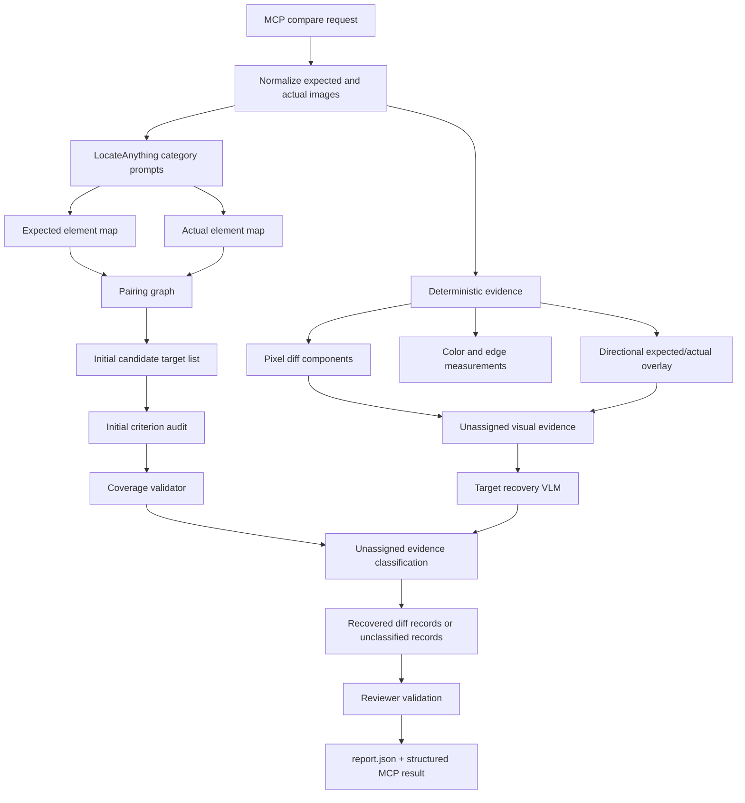

# Free-First UI Diff Hardening Implementation Plan

> **For agentic workers:** REQUIRED SUB-SKILL: Use superpowers:subagent-driven-development (recommended) or superpowers:executing-plans to implement this plan task-by-task. Steps use checkbox (`- [ ]`) syntax for tracking.

**Goal:** Make `ui-diff-mcp` a free-first, automated UI-diff system whose model choices, target discovery, visual evidence, color checks, and report contracts match the project goal: find and report visible UI diffs, without user-authored ROIs and without code/config advice.

**Architecture:** Keep the existing TypeScript MCP pipeline, but split the current broad model flow into explicit model selection, locator, target-recovery, artifact-evidence, audit, and coverage stages. Artifacts become machine-readable evidence consumed by models and reports, not a manual inspection path. Deterministic signals remain supporting evidence and coverage checks; they must not become the primary ROI source.

**Tech Stack:** Node.js 22+, TypeScript ESM, MCP TypeScript SDK, Zod, Sharp, PNGJS/pixelmatch, OpenRouter Chat Completions, NVIDIA OpenAI-compatible VLM endpoints, LocateAnything sidecar, Vitest.

---

## Why This Plan Exists

Live Calorix runs exposed these product gaps:

- The default audit path used paid OpenRouter models even though the project direction was free-first.
- `free_only` mode exists but still selects the paid `auditor` and `reviewer` roles.
- The NVIDIA VLM adapter exists, but the main audit path does not use it.
- LocateAnything was run with one broad prompt and returned mostly text targets, missing cards, rings, progress bars, icons, and larger UI components.
- The auditor only received expected/actual crops for located pairs. It did not receive the full directional diff image, pixel diff, or unassigned visual-change regions.
- `pixel-diff.png` and `diff-overlay.png` are report artifacts, but not currently active audit evidence. The hardened pipeline must feed directional overlays and local pixel-diff mask crops to audit/recovery models.
- Crop filenames are traceable through `report.json`, but not self-describing enough when only a bounded subset is audited.
- Color comparison is a hardcoded average-RGB trigger and is too weak for exact UI diffing.
- The current coverage check is real code, but primitive: it creates `unclassified_visual_change` records for uncovered changed-pixel components; it does not classify them.

## Current Implementation Facts To Preserve

- `src/report/coverage.ts` creates `unclassified_visual_change` records for changed-pixel components not overlapping accepted diffs.
- `src/pipeline/run-ui-diff.ts` creates normalized images, pixel diff, and overlay artifacts.
- `src/audit/audit-target.ts` sends only expected crop and actual crop images to auditor/reviewer.
- `src/models/nvidia-client.ts` can call an NVIDIA OpenAI-compatible endpoint, but is not selected by the pipeline.
- `src/models/model-registry.ts` has free model roles, but required roles are still paid defaults.
- Bounded Calorix smoke passed with `UI_DIFF_MAX_AUDIT_PAIRS=3`; full all-target Calorix audit was not signed off.

## Research Snapshot: Free Model Providers

Native NVIDIA model research is tracked in:

- `docs/research/nvidia-api-vlm-research-2026-06-14.md`

### OpenRouter

OpenRouter's Models API exposes model metadata including `architecture.input_modalities`, `pricing`, `supported_parameters`, and top-provider limits. The API can sort by throughput, and provider routing can prefer throughput or latency. OpenRouter's free model variants have free usage limits of 20 requests/minute, 50 requests/day for accounts with less than $10 purchased credits, and 1000 requests/day with at least $10 purchased credits.

Current free image-capable OpenRouter candidates from live metadata/research on 2026-06-14. This table is not a ranking; the only ranking in this plan is under "Canonical Model Candidate Ranking."

| Model | Keep? | Reason |
| --- | --- | --- |
| `moonshotai/kimi-k2.6:free` | Yes, top free OpenRouter candidate | Image input, free route available, and strongest current OpenRouter quality signal among the free multimodal candidates; still must pass UI-diff probes and quota checks. |
| `nex-agi/nex-n2-pro:free` | Yes, OpenRouter free auditor candidate | Image input, free pricing, metadata lists `response_format` and `structured_outputs`; still must pass UI-diff probes. |
| `google/gemma-4-31b-it:free` | Yes, probe candidate | Image input, free pricing, `response_format`; no explicit `structured_outputs` in metadata. |
| `google/gemma-4-26b-a4b-it:free` | Yes, probe candidate | Image input, free pricing, `response_format`; likely useful as alternate reviewer/auditor if probes pass. |
| `nvidia/nemotron-nano-12b-v2-vl:free` | Yes, probe candidate | NVIDIA VL model via OpenRouter, image input, free pricing; metadata does not list `response_format`, so JSON must be prompt+parser+probe validated. |
| `nvidia/nemotron-3-nano-omni-30b-a3b-reasoning:free` | Yes, probe candidate | Free omni-modal reasoning model with image input; metadata lacks structured-output flags, so strict schema use is unproven until probed. |
| `nvidia/nemotron-3.5-content-safety:free` | No | Content-safety model for unsafe/toxic content detection, not a UI-diff auditor or reviewer. |

Observed project OpenRouter activity from `C:\Users\xursc\Downloads\openrouter_activity_2026-06-14.csv`:

| Model/provider | Requests | Cost | Avg completion tok/s | Min | Max |
| --- | ---: | ---: | ---: | ---: | ---: |
| `qwen/qwen3-vl-30b-a3b-instruct` / AtlasCloud | 52 | $0.007734 | 47.1 | 7.6 | 126.6 |
| `qwen/qwen3-vl-30b-a3b-instruct` / Novita | 21 | $0.005472 | 48.0 | 4.6 | 123.6 |
| `qwen/qwen3-vl-30b-a3b-instruct` / DeepInfra | 36 | $0.002218 | 21.4 | 5.7 | 48.7 |
| `qwen/qwen3-vl-30b-a3b-instruct` / SiliconFlow | 8 | $0.001422 | 18.3 | 0.8 | 50.9 |
| `google/gemini-2.5-flash-lite` / Google | 9 | $0.000783 | 21.2 | 7.5 | 30.3 |

This proves provider speed varies enough that the MCP must measure and record provider/model throughput per run instead of assuming a model is fast.

### NVIDIA API

NVIDIA Build/NIM exposes free serverless APIs for development and self-hostable NIM containers. NVIDIA hosted chat completions use the OpenAI-compatible base URL `https://integrate.api.nvidia.com/v1`, and VLM NIM examples use `image_url` message parts, including base64 data URLs for local images. NVIDIA's VLM structured-generation docs recommend `response_format: { type: "json_schema" }` rather than `json_object`, because `json_object` only guarantees valid JSON, not schema adherence.

NVIDIA must become a first-class provider candidate:

- Native NVIDIA free endpoint: selected when `NVIDIA_API_KEY` is configured. If `NVIDIA_VLM_BASE_URL` is absent, default to NVIDIA's hosted OpenAI-compatible base URL `https://integrate.api.nvidia.com/v1`.
- OpenRouter NVIDIA free models: selected through OpenRouter when native NVIDIA is unavailable.
- Local/self-hosted NIM: same adapter contract as native NVIDIA endpoint.
- NVIDIA candidate discovery must not be hardcoded only to Nemotron. Current NVIDIA Build/NIM vision candidates to probe include Qwen3.6, Qwen3.5, Kimi K2.6, Nemotron Nano 12B v2 VL, MiniMax M3, Llama 3.2 Vision, Nemotron 3 Nano Omni, Llama 3.1 Nemotron Nano VL, Cosmos3 Nano Reasoner, and PaliGemma when those endpoints are available to the configured key.

Native NVIDIA candidate details are recorded in `docs/research/nvidia-api-vlm-research-2026-06-14.md`. The implementation plan below contains one provider-agnostic candidate ranking; do not maintain a second ranking in this research snapshot.

## Sources

- OpenRouter Models API: https://openrouter.ai/docs/guides/overview/models
- OpenRouter structured outputs: https://openrouter.ai/docs/guides/features/structured-outputs
- OpenRouter provider routing and throughput preferences: https://openrouter.ai/docs/guides/routing/provider-selection
- OpenRouter Nitro throughput variant: https://openrouter.ai/docs/guides/routing/model-variants/nitro
- OpenRouter free model limits: https://openrouter.ai/docs/api/reference/limits
- NVIDIA Nemotron Nano 12B v2 VL API: https://docs.nvidia.com/nim/vision-language-models/1.5.0/examples/nemotron-nano-12b-v2-vl/api.html
- NVIDIA VLM structured generation: https://docs.nvidia.com/nim/vision-language-models/1.0.0/structured-generation.html
- NVIDIA Build model card: https://build.nvidia.com/nvidia/nemotron-nano-12b-v2-vl
- NVIDIA Vision models catalog: https://build.nvidia.com/explore/vision
- NVIDIA Qwen3.5 397B A17B: https://build.nvidia.com/qwen/qwen3.5-397b-a17b
- NVIDIA Qwen3.6 VLM docs: https://docs.nvidia.com/nim/vision-language-models/1.7.0/examples/qwen3.6/api.html
- NVIDIA-hosted Kimi K2.6: https://build.nvidia.com/moonshotai/kimi-k2.6
- NVIDIA-hosted MiniMax M3: https://build.nvidia.com/minimaxai/minimax-m3/modelcard
- OpenRouter Kimi K2.6: https://openrouter.ai/moonshotai/kimi-k2.6-20260420
- OpenRouter Kimi K2.6 free: https://openrouter.ai/moonshotai/kimi-k2.6:free
- OpenRouter MiniMax M3: https://openrouter.ai/minimax/minimax-m3
- NVIDIA-hosted DeepSeek V4 Pro: https://build.nvidia.com/deepseek-ai/deepseek-v4-pro
- NVIDIA DeepSeek V4 Pro API docs: https://docs.api.nvidia.com/nim/reference/deepseek-ai-deepseek-v4-pro
- NVIDIA Nemotron 3 Ultra 550B: https://build.nvidia.com/nvidia/nemotron-3-ultra-550b-a55b
- NVIDIA Cosmos 3 Nano Reasoner: https://build.nvidia.com/nvidia/cosmos3-nano-reasoner
- NVIDIA-hosted Meta Llama 3.2 11B Vision Instruct: https://build.nvidia.com/meta/llama-3.2-11b-vision-instruct
- NVIDIA-hosted PaliGemma: https://build.nvidia.com/google/google-paligemma

## Non-Negotiable Product Rules

- No human-inspection workflow. Visual artifacts are machine evidence and report evidence.
- No user-authored target maps, ROIs, ignore masks, or anchor dumps.
- No root cause explanations.
- No app-code, design-code, or MCP-config recommendations in reports.
- No false complete reports: a bounded smoke run must expose `visualClassificationStatus: "incomplete"` and structured audit-limit metadata.
- No deterministic blob-only target source. Pixel/edge/color regions can raise unassigned visual evidence, but VLM/locator validation must classify them before they become target-level findings.
- Paid models are disabled by default unless the user explicitly selects paid mode.

## Target Architecture



## Model Selection Policy

### Modes

| Mode | Behavior |
| --- | --- |
| `free` | Default. Use native NVIDIA free endpoint if configured and probes pass; otherwise use pinned OpenRouter `:free` candidates that pass probes. |
| `free_openrouter` | Only OpenRouter free candidates. |
| `free_nvidia` | Only native NVIDIA/API/NIM candidates. |
| `paid` | Use paid pinned models only when the user explicitly selects this mode. |
| `deterministic_only` | No VLM audit; reports deterministic evidence and `visualClassificationStatus: "not_run"`. |

### Canonical Model Candidate Ranking

This is the only model ranking in this implementation plan. It is provider-agnostic: OpenRouter, native NVIDIA, or self-hosted NIM are delivery routes for the same candidate, not separate rankings. The selector walks this list and uses the first candidate whose configured provider route passes all gates.

1. `moonshotai/kimi-k2.6`
2. `minimaxai/minimax-m3`
3. `qwen/qwen3.5-397b-a17b`
4. `qwen/qwen3.6-35b-a3b`
5. `nvidia/nemotron-3-nano-omni-30b-a3b-reasoning`
6. `nvidia/nemotron-nano-12b-v2-vl`
7. `meta/llama-3.2-90b-vision-instruct`
8. `meta/llama-3.2-11b-vision-instruct`
9. `nex-agi/nex-n2-pro:free`
10. `google/gemma-4-31b-it:free`
11. `google/gemma-4-26b-a4b-it:free`
12. `nvidia/llama-3.1-nemotron-nano-vl-8b-v1`
13. `nvidia/cosmos3-nano-reasoner`
14. `google/google-paligemma`

Selection gates, evaluated in order:

- Provider route available for the requested mode: OpenRouter free, native NVIDIA, self-hosted NIM, or paid opt-in.
- Image input accepted with two images.
- Expected/actual order probe passes.
- Directional overlay comprehension probe passes.
- Strict JSON schema or parser-safe JSON probe passes.
- UI-diff crop probe passes.
- Unassigned-region classification probe passes for target-recovery roles.
- Licensing permits the run. This can block `minimaxai/minimax-m3` in production/commercial contexts when only NVIDIA's non-commercial terms are available.
- Free quota is sufficient before model calls start.
- Latency and throughput fit the configured run budget.

Speed note: OpenRouter can route by throughput with provider sorting or `:nitro`, and the project has OpenRouter activity logs with tokens/sec by provider. NVIDIA Build/API does not expose enough public per-key historical usage or speed logs to make a trustworthy static speed ranking. Therefore speed must be measured during probes and recorded in `report.json`; if the best-quality model is too slow in practice, Task 3 benchmarks decide whether to demote it.

Explicitly excluded:

- `nvidia/nemotron-3.5-content-safety:free`
- Native NVIDIA / NVIDIA-hosted safety models such as Llama Guard or NemoGuard.
- Text-only Nemotron Ultra/Super/Nano LLMs, including `nvidia/nemotron-3-ultra-550b-a55b` and deprecated `nvidia/llama-3.1-nemotron-ultra-253b-v1`, from visual audit roles.
- Text-only DeepSeek V4 models, including `deepseek-ai/deepseek-v4-pro` and `deepseek-ai/deepseek-v4-flash`, from visual audit roles unless a future NVIDIA/OpenRouter endpoint explicitly advertises image input and passes the UI-diff image probes.
- Deprecated models such as VILA and NeVA.
- Specialized extraction/domain models as default auditors, including `nvidia/nemotron-parse` and `nvidia/ising-calibration-1-35b-a3b`.
- Any safety/moderation-only, embedding-only, image-generation-only, text-only, or narrow domain-specific model unless explicitly assigned to a non-audit helper role and proven by probes.

### Required Probes

Before a model can be used as auditor, reviewer, or target-recovery model, it must pass:

- Image input probe with two images and expected/actual order check.
- Strict JSON schema probe if the provider claims schema support.
- JSON parser probe if schema support is absent; failure excludes the model from structured audit roles.
- Directional overlay comprehension probe.
- UI-diff crop probe.
- Unassigned-region classification probe.
- Latency and throughput probe.
- Rate-limit/availability probe that records 429 or quota state.

Each probe result is stored in `report.json` and `.ui-diff/generated/model-health-cache.json` with short TTL for free models.

The audit pipeline must not call provider-specific functions directly. Model selection returns a `SelectedVisionModel` with provider, model id, endpoint details, cost class, probe result, and a provider-agnostic `callVisionJson` function. Audit, review, target recovery, and probes all call through that provider abstraction.

### Free Quota Budget Gate

Free-first cannot start an unbounded model run blindly. Before any OpenRouter `:free` audit or recovery run:

- Estimate request count before the run: model probes + target recovery calls + auditor calls + reviewer calls.
- Query `GET https://openrouter.ai/api/v1/key` when an OpenRouter key is present and record `is_free_tier`, `limit_remaining`, and current daily usage when returned.
- Apply documented free limits when key quota details are unavailable: 20 requests/minute, 50 requests/day below $10 purchased credits, 1000 requests/day with at least $10 purchased credits.
- Throttle OpenRouter free calls to at most 18 requests/minute to stay under the 20 RPM cap.
- If estimated calls exceed available free quota, do not start the visual model run. Return `status: "insufficient_free_quota"`, `visualClassificationStatus: "incomplete"`, and a structured warning with estimated calls and available quota.
- Native NVIDIA free endpoints also get a request budget, but the exact limit is measured from live responses and configured limits because NVIDIA Build free endpoint limits can differ by account/model.

`insufficient_free_quota` is a first-class incomplete state, not a model failure.

## Artifact And Evidence Policy

Artifact paths must become typed records rather than anonymous strings where new roles are needed:

```ts
type UiArtifact = {
  role:
    | "expected_normalized"
    | "actual_normalized"
    | "pixel_diff"
    | "pixel_diff_mask"
    | "directional_overlay"
    | "target_map_expected"
    | "target_map_actual"
    | "expected_crop"
    | "actual_crop"
    | "local_directional_overlay"
    | "local_pixel_diff_mask"
    | "context_crop";
  path: string;
  pairId?: string;
  diffId?: string;
  targetLabel?: string;
};
```

Compatibility rule: MCP compact output may still expose string paths for easy agent consumption, but `report.json` must store typed artifacts. Existing `runArtifacts: string[]` and `artifactPaths: string[]` should either be migrated or accompanied by typed `artifacts: UiArtifact[]`; the plan implementation must choose one schema and update all report writer/tests consistently.

Required run artifacts:

- `expected-normalized.png`
- `actual-normalized.png`
- `pixel-diff.png`
- `pixel-diff-mask.png`
- `directional-diff-overlay.png`
- `target-map-expected.png`
- `target-map-actual.png`
- per-audited-pair expected crop
- per-audited-pair actual crop
- per-audited-pair local directional overlay
- per-audited-pair local pixel-diff mask crop
- per-unassigned-region directional crop
- per-unassigned-region pixel-diff mask crop

Directional overlay colors:

- Expected-only visual mass: cyan.
- Actual-only visual mass: magenta.
- Similar/overlap visual mass: neutral gray.
- Changed-region outline: yellow.

Artifacts must be referenced from structured report fields. The auditor must receive the relevant artifact images as input, not only text paths.

`pixel-diff.png` remains useful as the raw changed-pixel evidence. `directional-diff-overlay.png` makes expected-vs-actual direction understandable. Both local forms are model inputs.

## Coverage Policy

The current `unclassified_visual_change` coverage gate remains, but it is no longer enough.

New coverage behavior:

- Step 1: after initial target audit, changed-pixel components that overlap accepted target diffs are marked `covered_by_diff`.
- Step 2: changed-pixel components that do not overlap accepted target diffs become `unassigned_visual_evidence` records, not final diffs yet.
- Step 3: unassigned evidence is passed to the target-recovery VLM with full directional overlay, region crop, expected crop, actual crop, and pixel-diff mask crop.
- Step 4: recovery returns `RecoveredDiffCandidate` records directly. It does not merge synthetic elements back into the first audit loop for MVP, because that would require re-pairing after coverage.
- Step 5: recovered diff candidates go through reviewer validation and duplicate merge.
- Step 6: evidence that remains unclassified becomes `unclassified_visual_change`.
- Step 7: `visualClassificationStatus` is `complete` only when every significant changed-pixel component is covered by an accepted initial diff, accepted recovered diff, or below the configured significance threshold.
- Step 8: if any significant region remains unclassified, `visualClassificationStatus` is `incomplete`.
- Any recovered target box must declare its coordinate frame, stay within image bounds, overlap or contain enough of the changed-pixel component, and pass deterministic snapping before it is merged into target candidates.

Core data contracts:

```ts
type UnassignedVisualEvidence = {
  id: string;
  componentBox: Box;
  pixelCount: number;
  componentArea: number;
  expectedCropArtifact: UiArtifact;
  actualCropArtifact: UiArtifact;
  directionalOverlayArtifact: UiArtifact;
  pixelDiffMaskArtifact: UiArtifact;
};

type RecoveredDiffCandidate = {
  id: string;
  evidenceId: string;
  criterion: UiCriterion;
  severity: "low" | "medium" | "high";
  label: string;
  coordinateFrame: "expected" | "actual" | "normalized";
  box: Box;
  evidence: string[];
  measurements: DeterministicMeasurement[];
  artifactIds: string[];
};
```

## LocateAnything Policy

Replace the single broad prompt with category prompts:

- `Detect all visible text labels in box format.`
- `Locate all buttons and tappable controls in box format.`
- `Locate all cards, panels, and rounded containers in box format.`
- `Locate all icons and navigation icons in box format.`
- `Locate all charts, rings, progress indicators, and bars in box format.`
- `Locate all tab bar and navigation elements in box format.`
- `Locate all list rows and repeated item containers in box format.`
- `Locate all image thumbnails and avatars in box format.`

Each sidecar response element must preserve `queryId`, so `type` comes from the query, not only from label guessing. If category prompts still return text-only results, the run records `locatorCoverageStatus: "weak"` and the target-recovery stage must be enabled.

## Color Comparison Policy

Replace the current hardcoded average RGB trigger with structured color evidence:

- Dominant palette per target and per unassigned visual region.
- Foreground/background split when text or icons are detected.
- Named Lab or OKLab color-distance metrics recorded as measurements. RGB-distance may be retained only as a debug value, not as the primary decision metric.
- Configurable thresholds per element kind, with defaults stored in code and exposed in report metadata.
- Alpha/opacity handling for translucent overlays, shadows, and disabled states.
- Color diffs must report expected color, actual color, sampled region, metric, and threshold.

The threshold still exists to avoid anti-aliasing and rendering-noise false positives, but it must be visible in the report and justified as a measurement threshold, not hidden behavior.

## Implementation Tasks

### Task 1: Model Registry And Mode Semantics

**Files:**
- Create: `src/models/vision-json.ts`
- Modify: `src/models/model-registry.ts`
- Modify: `src/pipeline/run-ui-diff.ts`
- Modify: `src/audit/audit-target.ts`
- Modify: `src/audit/review-findings.ts`
- Modify: `src/schemas/tool-schemas.ts`
- Test: `tests/unit/model-registry.test.ts`
- Test: `tests/unit/run-ui-diff-config.test.ts`
- Test: `tests/unit/audit.test.ts`

- [ ] Add modes `free`, `free_openrouter`, `free_nvidia`, `paid`, and `deterministic_only`.
- [ ] Make `free` the default mode.
- [ ] Ensure `free_only` is removed or treated as a deprecated alias for `free`.
- [ ] Make paid models unavailable unless mode is `paid`.
- [ ] Exclude safety/moderation-only models from audit/review roles.
- [ ] Add `insufficient_free_quota` to run status schemas and compact MCP output.
- [ ] Create `SelectedVisionModel` and `callVisionJson` abstractions in `src/models/vision-json.ts`.
- [ ] Refactor `auditElementPair` so it receives provider-agnostic caller functions instead of importing `callOpenRouterVisionJson` directly.
- [ ] Refactor reviewer calls to use the same provider-agnostic caller.
- [ ] Add tests that `free` never selects paid Qwen/Gemini models.
- [ ] Add tests that `paid` selects paid models only when requested.
- [ ] Add tests that audit code can call an NVIDIA-selected model without importing the OpenRouter client.
- [ ] Run `npm run verify`.
- [ ] Commit and push.

### Task 2: Native NVIDIA Provider Selection

**Files:**
- Modify: `src/models/nvidia-client.ts`
- Modify: `src/models/probes.ts`
- Modify: `src/models/model-registry.ts`
- Test: `tests/unit/model-clients.test.ts`
- Test: `tests/unit/probes.test.ts`

- [ ] Add native NVIDIA candidate entries with provider `nvidia`.
- [ ] Add NVIDIA model discovery for configured endpoints when available; otherwise use the known candidate list in this plan.
- [ ] Use `docs/research/nvidia-api-vlm-research-2026-06-14.md` as the source of truth for initial native NVIDIA candidates and exclusions.
- [ ] Use `https://integrate.api.nvidia.com/v1` as the native NVIDIA default base URL when `NVIDIA_API_KEY` is set and `NVIDIA_VLM_BASE_URL` is unset.
- [ ] Support NVIDIA `response_format: { type: "json_schema" }` for strict schema requests.
- [ ] Record if an NVIDIA endpoint only supports `json_object` or parser-only JSON.
- [ ] Probe image input, strict JSON, and expected/actual order for each NVIDIA candidate.
- [ ] Fail closed if NVIDIA returns parseable JSON but violates schema.
- [ ] Run `npm run verify`.
- [ ] Commit and push.

### Task 3: Free Model Benchmark Harness

**Files:**
- Create: `scripts/benchmark-free-models.ts`
- Create: `docs/research/free-model-benchmark.md`
- Create: `src/models/free-quota.ts`
- Modify: `package.json`
- Modify: `.gitignore`
- Test: `tests/unit/model-benchmark.test.ts`
- Test: `tests/unit/free-quota.test.ts`

- [ ] Add `npm run benchmark:models`.
- [ ] Query OpenRouter Models API and filter candidates by free pricing, image input, text output, and non-safety purpose.
- [ ] Probe native NVIDIA candidates when NVIDIA env vars are present.
- [ ] Measure TTFT, generation time, completion tokens/sec, schema success, parser success, expected/actual order, and UI-diff fixture accuracy.
- [ ] Implement `estimateFreeRunBudget({ modelCount, pairCount, criteriaPerPair, recoveryRegionCount, reviewerPolicy })`.
- [ ] Implement OpenRouter key quota lookup against `/api/v1/key`.
- [ ] Implement OpenRouter free-call throttling at 18 requests/minute.
- [ ] Return `insufficient_free_quota` before starting visual model calls when estimated calls exceed available quota.
- [ ] Write results to `.ui-diff/generated/model-benchmark.json`.
- [ ] Keep benchmark output out of git.
- [ ] Verify `.gitignore` excludes `.ui-diff/` and generated benchmark JSON.
- [ ] Document latest benchmark summary in `docs/research/free-model-benchmark.md` without secrets.
- [ ] Run `npm run verify`.
- [ ] Commit and push.

### Task 4: LocateAnything Category Prompts

**Files:**
- Modify: `src/pipeline/run-ui-diff.ts`
- Modify: `src/locator/element-map.ts`
- Modify: `src/locator/locateanything-client.ts`
- Modify: `src/schemas/core.ts`
- Modify: `src/schemas/tool-schemas.ts`
- Modify: `src/report/report-writer.ts`
- Test: `tests/e2e/compare-ui-images.test.ts`
- Test: `tests/unit/element-map.test.ts`
- Test: `tests/unit/schemas.test.ts`

- [ ] Replace the one broad prompt with category prompts.
- [ ] Preserve `queryId` on each `UiElement`.
- [ ] Map `queryId` to `UiElement.type` before falling back to label guessing.
- [ ] Add report metadata for locator prompt count and per-query element counts.
- [ ] Add `locatorCoverageStatus: "complete" | "weak" | "failed"` to report schema.
- [ ] Test that cards, icons, rings, progress bars, nav, and list rows can be represented as first-class elements.
- [ ] Run `npm run verify`.
- [ ] Commit and push.

### Task 5: Directional Diff Artifacts

**Files:**
- Create: `src/images/directional-diff.ts`
- Modify: `src/images/artifacts.ts`
- Modify: `src/pipeline/run-ui-diff.ts`
- Modify: `src/schemas/core.ts`
- Modify: `src/report/report-writer.ts`
- Test: `tests/unit/directional-diff.test.ts`
- Test: `tests/unit/report.test.ts`

- [ ] Generate `directional-diff-overlay.png` with cyan expected-only, magenta actual-only, neutral overlap, and yellow changed-region outlines.
- [ ] Generate local directional overlays for audited pairs and unassigned regions.
- [ ] Generate local pixel-diff mask crops for audited pairs and unassigned regions.
- [ ] Add structured artifact roles to `runArtifacts` and per-diff `artifactPaths`.
- [ ] Define whether the report keeps string path arrays plus typed artifacts or fully migrates to typed artifacts; update schemas and report writer accordingly.
- [ ] Ensure old `diff-overlay.png` is either replaced or clearly marked legacy in report metadata.
- [ ] Test color channels on synthetic expected-only and actual-only regions.
- [ ] Run `npm run verify`.
- [ ] Commit and push.

### Task 6: Auditor Evidence Payload

**Files:**
- Modify: `src/audit/audit-target.ts`
- Modify: `src/audit/prompts.ts`
- Modify: `src/audit/criteria.ts`
- Modify: `src/schemas/core.ts`
- Test: `tests/unit/audit.test.ts`

- [ ] Send expected crop, actual crop, local directional overlay, local pixel-diff mask crop, and target context crop to the auditor.
- [ ] Send the same evidence to the reviewer.
- [ ] Add explicit `AuditEvidenceImages` context fields in this order: expected crop, actual crop, local directional overlay, local pixel-diff mask crop, target context crop.
- [ ] Include deterministic measurements in both prompts.
- [ ] Keep prompts strictly diff-only: no causes, no fixes, no acceptance language.
- [ ] Add tests that audit requests contain the directional overlay image.
- [ ] Run `npm run verify`.
- [ ] Commit and push.

### Task 7: Target Recovery Stage

**Files:**
- Create: `src/recovery/target-recovery.ts`
- Modify: `src/report/coverage.ts`
- Modify: `src/pipeline/run-ui-diff.ts`
- Modify: `src/schemas/core.ts`
- Modify: `src/audit/review-findings.ts`
- Test: `tests/unit/target-recovery.test.ts`
- Test: `tests/unit/coverage.test.ts`
- Test: `tests/e2e/compare-ui-images.test.ts`

- [ ] Convert uncovered changed-pixel components into `unassigned_visual_evidence` records.
- [ ] For each significant unassigned region, crop expected, actual, and directional overlay regions.
- [ ] Include the local pixel-diff mask crop in each recovery request.
- [ ] Ask the target-recovery VLM to classify the region into built-in criteria or return `unclassified`.
- [ ] Validate target-recovery JSON with Zod.
- [ ] Return `RecoveredDiffCandidate` records directly from recovery; do not re-enter the initial target-pair audit loop in this implementation.
- [ ] Review recovered diff candidates with the standard reviewer before adding them to final diffs.
- [ ] Convert still-unclassified evidence to `unclassified_visual_change` and mark visual classification incomplete.
- [ ] Require recovery JSON to include coordinate frame: `expected`, `actual`, or `normalized`.
- [ ] Reject recovered boxes outside image bounds.
- [ ] Reject or keep unclassified recovered boxes that do not overlap/contain enough changed-pixel mass.
- [ ] Snap validated recovered boxes to deterministic visual signals before merging.
- [ ] Merge recovered targets into the candidate list only when the model supplies a visible label, criterion, and bounding box.
- [ ] If recovery cannot classify a significant region, keep `visualClassificationStatus: "incomplete"`.
- [ ] Run `npm run verify`.
- [ ] Commit and push.

### Task 8: Crop And Artifact Naming

**Files:**
- Modify: `src/audit/audit-target.ts`
- Modify: `src/report/report-writer.ts`
- Modify: `src/pipeline/run-ui-diff.ts`
- Modify: `src/schemas/core.ts`
- Modify: `src/schemas/tool-schemas.ts`
- Test: `tests/unit/report.test.ts`
- Test: `tests/unit/run-ui-diff-config.test.ts`

- [ ] Rename pair artifacts to include audit index, audit total, pair id, target slug, side, and artifact type.
- [ ] Example: `audit-001-of-003-pair-a577c9d7bed3-kcal-value-expected-crop.png`.
- [ ] Keep pair id in the filename for report lookup.
- [ ] Add `auditScope` to report with `auditedPairs`, `totalPairs`, `auditLimited`, and `limitReason`.
- [ ] Run `npm run verify`.
- [ ] Commit and push.

### Task 9: Color Evidence Module

**Files:**
- Modify: `src/signals/color.ts`
- Modify: `src/audit/criteria.ts`
- Modify: `src/pipeline/run-ui-diff.ts`
- Modify: `src/schemas/core.ts`
- Test: `tests/unit/color.test.ts`

- [ ] Replace the hidden `> 30` RGB-sum trigger with named Lab/OKLab thresholds.
- [ ] Record average RGB debug values, dominant palette, foreground/background samples, Lab/OKLab metric value, alpha/opacity data, and threshold.
- [ ] Add configurable defaults per target type in code.
- [ ] Include color measurements in `DiffRecord.measurements`.
- [ ] Add tests for same-color anti-alias tolerance and clear color mismatch.
- [ ] Run `npm run verify`.
- [ ] Commit and push.

### Task 10: Report Contract Hardening

**Files:**
- Modify: `src/schemas/core.ts`
- Modify: `src/report/report-writer.ts`
- Modify: `src/server.ts`
- Test: `tests/unit/schemas.test.ts`
- Test: `tests/unit/tools.test.ts`

- [ ] Add `modelSelection`, `providerMetrics`, `quotaBudget`, `locatorCoverageStatus`, `auditScope`, `coverageStatus`, and structured artifact roles to `UiDiffReport`.
- [ ] Ensure MCP compact output includes `visualClassificationStatus`, `auditLimited`, and `coverageStatus`.
- [ ] Ensure bounded smoke cannot be mistaken for full visual classification.
- [ ] Run `npm run verify`.
- [ ] Commit and push.

### Task 11: Live Gates

**Files:**
- Modify: `tests/live/openrouter.live.test.ts`
- Modify: `tests/live/calorix-smoke.live.test.ts`
- Create: `tests/live/nvidia-live.test.ts`
- Modify: `docs/release/production-readiness-checklist.md`

- [ ] Add `verify:free-live` gate for OpenRouter free models.
- [ ] Add `verify:nvidia-live` gate for NVIDIA endpoint when env vars are set.
- [ ] Add `verify:calorix-full-live` for unbounded all-target audit, allowed to be long-running.
- [ ] Record model/provider throughput and schema success in live report.
- [ ] Add a live or simulated free-quota gate proving `insufficient_free_quota` exits before model calls.
- [ ] Ensure skipped live gates exit nonzero unless their explicit `RUN_*` flag is unset by design.
- [ ] Run `npm run verify`.
- [ ] Commit and push.

### Task 12: Documentation

**Files:**
- Modify: `README.md`
- Modify: `.env.example`
- Modify: `docs/implementation-status.md`
- Modify: `docs/research/free-model-benchmark.md`

- [ ] Document free-first default behavior.
- [ ] Document how to configure native NVIDIA and OpenRouter free models.
- [ ] Document paid mode as explicit opt-in.
- [ ] Document that artifacts are automated evidence, not a manual inspection workflow.
- [ ] Document Calorix readiness distinction: bounded smoke vs full all-target audit.
- [ ] Run `npm run verify`.
- [ ] Commit and push.

## Acceptance Criteria

- Default mode never calls paid models.
- Free mode estimates required requests and exits with `insufficient_free_quota` before starting when quota is insufficient.
- `free` mode selects native NVIDIA first when configured and probes pass.
- `free_openrouter` mode uses only OpenRouter `:free` models.
- `paid` mode is explicit and records paid model use in `report.json`.
- Auditor and reviewer receive directional overlays, not only expected/actual crops.
- Auditor, reviewer, and target recovery receive local pixel-diff mask evidence where relevant.
- LocateAnything produces typed element maps from category prompts, or reports weak locator coverage.
- Significant unassigned visual evidence is passed through target recovery before becoming `unclassified_visual_change`.
- Color differences include visible measurements and thresholds.
- Bounded smoke runs cannot look like full classification.
- No report contains root cause, implementation suggestions, or acceptance language.
- `npm run verify`, coverage, and relevant live gates pass before release sign-off.

## Self-Review

- Spec coverage: covers free-first model policy, NVIDIA native use, OpenRouter current free candidates, LocateAnything target weakness, artifacts as machine evidence, directional overlays, target recovery, crop naming, color thresholds, and deterministic coverage limits.
- Placeholder scan: no TBD/TODO placeholders are present.
- Risk: exact free model ranking must be confirmed by live benchmark, because free endpoints and model metadata change. This is handled by Task 3 and probe-gated selection.
- Risk: target recovery can become a whole-screen mega-prompt if scoped poorly. This plan limits recovery to significant unassigned visual regions with cropped evidence.

## Reviewer Results

### Gemini 3 Pro Preview

Review completed with `gemini-3-pro-preview` on 2026-06-14.

- `AGREEMENT_STATUS`: agree.
- `MUST_FIX`: none.
- `SHOULD_FIX`: add current NVIDIA vision/reasoning candidates such as `nvidia/cosmos3-nano-reasoner` and `meta/llama-3.2-11b-vision-instruct` to the NVIDIA probe candidate set.
- Change incorporated: Native NVIDIA candidate policy now probes discovered free VLM endpoints and includes Nemotron, Cosmos 3 Nano Reasoner, and Llama 3.2 Vision candidates when available.
- Research notes: Gemini agreed with free-first defaults, OpenRouter free rate-limit handling, exclusion of content-safety models, LocateAnything category prompts, directional diff artifacts as model inputs, target recovery, and structured color measurements.
- Final blocker pass after independent-review fixes: no implementation-critical gaps remain; Gemini confirmed free quota budgeting, NVIDIA default base URL, provider-agnostic vision caller, exact target recovery flow, typed artifact schema, pixel-diff mask model input, schema/report coverage, current live test filenames, and Lab/OKLab color metrics are addressed.

### Claude Sonnet 4.6

Requested by user but not completed because the current Codex session exposes no callable Claude Sonnet 4.6 review tool. Tool discovery found Gemini CLI, code-search, and GPT-family subagents, but no Claude Sonnet execution tool. If a Claude tool becomes available, ask it to independently research OpenRouter free vision models and NVIDIA free VLM endpoints, then review this plan for blockers.

### Independent Non-Claude Reviewer

Review completed by an available non-Claude subagent on 2026-06-14. This is not a Claude Sonnet 4.6 review.

- `MUST_FIX`: add free-quota preflight budget and throttling; define NVIDIA hosted default base URL; feed local pixel-diff evidence to models or state directional overlay supersedes it.
- `SHOULD_FIX`: require OpenRouter throughput routing for free runs; validate recovered boxes against unassigned changed mass; use Lab/OKLab color metrics with alpha handling.
- Changes incorporated: free quota budget gate, `insufficient_free_quota`, NVIDIA default base URL, local pixel-diff mask model inputs, OpenRouter throttling, recovered-box validation, and Lab/OKLab color policy.
