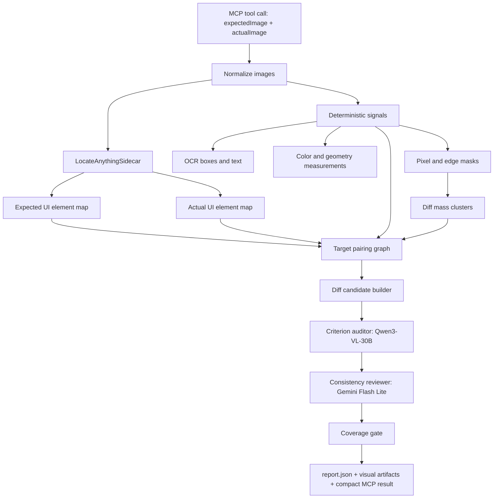
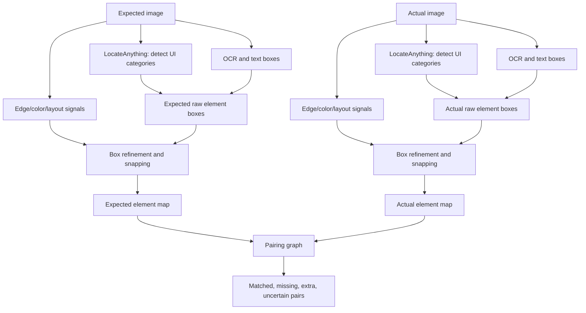
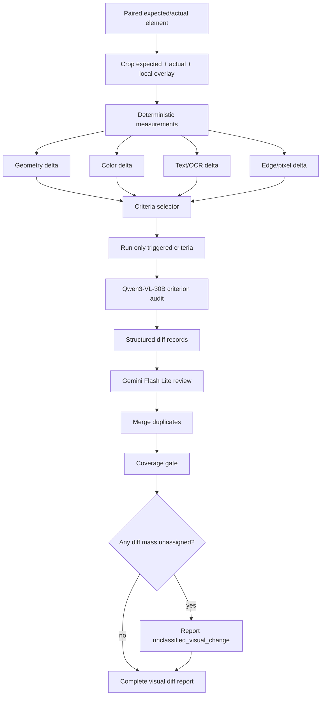

# UI Diff MCP Research Design

**Status:** draft v2 after project-owner rejection of the first plan. This version makes model choices, locator deployment, and diff flow explicit.

**Purpose:** `ui-diff-mcp` compares a mockup image and an actual mobile app screenshot, then reports every meaningful visual difference with location, visual category, evidence, and artifacts.

**Non-purpose:** It does not explain root cause, suggest app-code edits, suggest MCP config edits, or decide what an implementation agent should change. It only reports visible diffs as exactly as possible.

---

## Research Takeaways

- MCP should expose a small, task-specific tool surface with Zod schemas and structured output. The TypeScript SDK supports `registerTool`, `outputSchema`, `structuredContent`, and local `stdio` transport, which fits a local screenshot-analysis server.
- MCP security matters because this server may capture screens and run local commands. The server must avoid shell interpolation, validate paths, keep command execution narrow, and never expose broad filesystem or arbitrary command tools.
- Pixel comparison is still useful as a coverage signal. `pixelmatch` is fast and has anti-aliasing handling and configurable thresholds, but pixel diff alone cannot classify UI differences.
- Visual regression tools converge on the same loop: capture, compare, report. Most struggle with dynamic content, mobile devices, and explaining what changed; this MCP should specialize in those gaps rather than become a dashboard product.
- UI target discovery should use visual grounding. Research on UI grounding frames the problem as locating a UI element from a screenshot and language expression, not relying on app metadata.
- **Locator model decision:** use `nvidia/LocateAnything-3B` for target localization. It is designed for GUI grounding, OCR localization, dense detection, and box output. It reports SOTA ScreenSpot-Pro GUI grounding mean F1 60.3 and emits coordinate tokens that can be parsed into boxes.
- **Locator deployment decision:** use a `LocateAnythingSidecar` adapter, not the public Hugging Face Space. The public Space API was probed on 2026-06-12 and connected, but failed with a GPU-duration runtime error. The sidecar can be local Docker/Python or a managed endpoint; the TypeScript MCP talks to it over HTTP.
- **Historical paid-probe result:** `qwen/qwen3-vl-30b-a3b-instruct`, `qwen/qwen3-vl-8b-instruct`, `google/gemini-2.5-flash-lite`, and `qwen/qwen3-vl-235b-a22b-instruct` passed useful OpenRouter probes on 2026-06-12, but they are not default free-first choices.
- **Current model-selection source of truth:** use the provider-explicit ranking and route policy in `docs/superpowers/plans/2026-06-14-free-first-ui-diff-hardening.md`. That plan separates model family from provider route and cost class: native NVIDIA free endpoint, OpenRouter `:free`, self-hosted NIM, and paid OpenRouter routes are different routes with different eligibility.
- **Free-first mode:** default runs must prefer native NVIDIA free endpoint routes when configured and probed, then OpenRouter `:free` routes that are present in the OpenRouter Models API and pass probes. Paid OpenRouter routes are allowed only in explicit `paid` mode with `UI_DIFF_ENABLE_PAID_MODE=1`.
- **Free-route warning:** the same model family can be free on one provider and paid on another. For example, Kimi K2.6 has a native NVIDIA free endpoint route; the OpenRouter Models API check on 2026-06-14 listed OpenRouter Kimi as paid and did not list `moonshotai/kimi-k2.6:free`. MiniMax M3 and Mistral Large 3 are also free through native NVIDIA but paid through the verified OpenRouter routes.
- Free-tier model APIs are not stable infrastructure. Rate limits, endpoint churn, and model capability changes must be expected and reported as `model_unavailable`, not hidden behind degraded reports.
- LangGraph.js is useful for durable state, streaming, interrupts, and resumed graph execution. For the first version, a typed DAG/pipeline is faster to build and easier to test; keep the design LangGraph-compatible, but do not make LangGraph a required dependency until runs need resumability or human review.

---

## Product Boundary

The MCP receives:

- `expectedImage`: mockup/design image.
- `actualImage`: screenshot or freshly captured screen.
- Optional capture instructions.
- Optional prior generated MCP state.

The MCP returns:

- A compact JSON result with diff summary, target list, and artifact paths.
- A full `report.json` with all evidence.
- Visual artifacts: normalized images, overlays, crops, boxes, and coverage maps.

The MCP must not require:

- User-authored target maps.
- User-authored ROI boxes.
- User-authored ignore masks.
- Flutter anchor dumps.
- Manual visual criteria config.

The MCP may persist generated state:

- Auto-discovered target memory.
- Prior model health results.
- Prior target pairing corrections.
- Stable project-specific naming learned from previous runs.

Generated state must be inspectable and editable, but the default workflow must work from images alone.

---

## Proposed Architecture

```text
MCP tool
  -> image intake/capture
  -> normalize expected + actual
  -> deterministic signal extraction
  -> LocateAnything target localization
  -> target pairing graph
  -> criterion audit passes
  -> reviewer/consistency pass
  -> coverage check
  -> report writer
```

Use a plain typed orchestrator for MVP. Represent each stage as a node-like function with typed inputs/outputs so it can later move into LangGraph if durable execution becomes useful.

Architecture diagram source:

- `docs/architecture/diagrams/ui-diff-architecture.mmd`
- `docs/architecture/diagrams/ui-diff-architecture.svg`



### Why Not LangGraph First

LangGraph would help if runs become long-lived, resumable, interactive, or cross-session. The first MCP run is a bounded local analysis job. Adding LangGraph immediately increases dependency and state complexity before the target discovery and diff-report contract are proven.

### When To Add LangGraph

Add LangGraph when at least one is true:

- Model calls regularly exceed one host turn and need checkpoint resume.
- Human review of generated target memory becomes part of the run.
- The pipeline starts branching dynamically based on uncertainty.
- The same run must be inspected or resumed after process failure.

---

## Deterministic Checks

Deterministic checks are not “truth.” They are measurable signals that help ensure coverage and reduce model hallucination.

- Image metadata: dimensions, scale ratio, orientation, color space.
- Pixel diff: changed-pixel mask, percent, connected components.
- Perceptual similarity: SSIM/MS-SSIM or equivalent local similarity score for regions.
- Edge/shape diff: edge maps to catch border radius, stroke, icon outline, and clipping changes.
- Color sampling: dominant colors and sampled fills/strokes in matched boxes.
- OCR/text boxes: detected text, text bounding boxes, approximate font height, truncation.
- Geometry: box position, size, center, alignment, spacing, overlap, containment, baseline estimates.
- Coverage: every significant changed pixel cluster must be assigned to a target diff or reported as `unclassified_visual_change`.

These checks should never produce code suggestions. They produce measurements and artifacts.

---

## UI Criteria

Criteria are visual categories used to classify diffs. They are built in, not manually authored by users.

- Presence: missing, extra, duplicated, or invisible element.
- Geometry: position, size, scale, aspect ratio, radius, stroke width.
- Spacing/alignment: margins, gaps, baselines, centering, grouping, row/column rhythm.
- Typography/content: text mismatch, font size, weight, line height, wrapping, truncation.
- Color/appearance: fill, stroke, gradient, opacity, contrast, active/inactive state.
- Icon/image: wrong icon, missing icon, image crop, thumbnail, illustration mismatch.
- Layering/clipping: overlap, occlusion, shadow/glow, z-order, clipped content.
- Component state: selected tab, disabled state, loading state, toggle state, progress value.
- Chart/special geometry: arcs, rings, bars, progress tracks, angles, lengths, handles.

The report groups differences by target and criterion, but the target discovery must be automatic.

---

## Target Discovery

The first plan’s manual target config is rejected. Target discovery must be generated by the MCP.

Target discovery diagram source:

- `docs/architecture/diagrams/target-discovery-flow.mmd`
- `docs/architecture/diagrams/target-discovery-flow.svg`



### Stage 1: Visual Signals

Create pixel/edge/color/OCR signals from expected and actual images. Diff-region clustering means connected-component grouping over changed-pixel or changed-edge masks. It is not a user-facing strategy; it is a coverage signal that says, “there is changed visual mass here.”

### Stage 2: LocateAnything Locator

Run `nvidia/LocateAnything-3B` over expected and actual separately through `LocateAnythingSidecar`.

Prompts are category queries, not broad “tell me everything” prompts:

- `Locate all text labels.`
- `Locate all buttons and tappable controls.`
- `Locate all cards and panels.`
- `Locate all icons.`
- `Locate all charts, progress indicators, and rings.`
- `Locate all navigation/tab elements.`
- `Locate all list rows and repeated item containers.`
- `Detect all text in box format.`

LocateAnything returns box tokens in a normalized 0..1000 coordinate space. The sidecar parses those boxes, converts them to pixels, removes duplicates, and returns a typed `ElementMap`.

Do not depend on the public Hugging Face Space for MVP. It was probed successfully for connection but failed runtime execution with: `The requested GPU duration (240s) is larger than the maximum allowed`.

### LocateAnythingSidecar HTTP Contract

The TypeScript MCP owns orchestration and validation. The sidecar only localizes elements.

Endpoint:

```text
POST /v1/locate-ui-elements
```

Request:

```json
{
  "imagePath": "absolute/path/to/image.png",
  "queries": [
    { "id": "text", "prompt": "Detect all text in box format." },
    { "id": "controls", "prompt": "Locate all buttons and tappable controls." },
    { "id": "cards", "prompt": "Locate all cards and panels." },
    { "id": "charts", "prompt": "Locate all charts, progress indicators, and rings." }
  ],
  "generationMode": "hybrid",
  "maxBoxesPerQuery": 200
}
```

Response:

```json
{
  "model": "nvidia/LocateAnything-3B",
  "image": { "width": 1080, "height": 2400 },
  "elements": [
    {
      "queryId": "controls",
      "label": "search button",
      "box": { "x": 120, "y": 220, "width": 160, "height": 56 },
      "rawBox1000": [111, 92, 259, 115],
      "confidence": 0.82,
      "rawText": "<ref>search button</ref><box><111><92><259><115></box>"
    }
  ],
  "warnings": []
}
```

Validation rules:

- `box` is always pixel coordinates in the input image coordinate space.
- `rawBox1000` is the original LocateAnything normalized coordinate token.
- Boxes outside image bounds are rejected, not clipped silently.
- Duplicates are allowed in sidecar output; TypeScript merges them with deterministic IoU rules.
- A sidecar failure returns HTTP 503 with `{ "error": "locator_unavailable", "detail": "..." }`.
- The MCP report records sidecar model, generation mode, query prompts, duration, and warnings.

Locator output:

```json
{
  "elements": [
    {
      "id": "generated stable id",
      "label": "short visual label",
      "type": "text|button|card|image|icon|chart|nav|list_item|unknown",
      "box": { "x": 0.1, "y": 0.2, "width": 0.4, "height": 0.08 },
      "text": "optional OCR/visible text",
      "confidence": 0.0
    }
  ]
}
```

### Stage 3: Pairing Graph

Pair expected elements to actual elements using:

- Box overlap and relative position.
- OCR/text similarity.
- Visual type similarity.
- Color/shape/image embeddings when available.
- Parent/child layout relationships.

Unpaired expected elements become possible missing elements. Unpaired actual elements become possible extra elements.

### Stage 4: Box Refinement

Raw model boxes are not trusted as exact. They are refined by deterministic signals:

- Snap to nearest edge-mask bounding rectangle when IoU is plausible.
- Expand to include OCR boxes that are visually inside the same target.
- Split one coarse box into child boxes when OCR/layout signals show repeated rows.
- Merge duplicate boxes from category prompts when IoU is high and labels agree.
- Keep both parent and child boxes for hierarchy, but audit the smallest box that covers the visible diff.

The synthetic box probe showed why this matters: general VLMs often return approximate boxes. LocateAnything is selected because it is designed for grounding, but even its outputs still go through snapping and coverage checks.

### Stage 5: Diff Candidates

Create candidates from:

- Paired elements with geometry, color, text, or crop-level visual differences.
- Unpaired elements.
- Changed-pixel clusters not covered by any paired or unpaired element.

The last category is reported explicitly as `unclassified_visual_change`, so no diff disappears.

Diff-finding diagram source:

- `docs/architecture/diagrams/diff-finding-flow.mmd`
- `docs/architecture/diagrams/diff-finding-flow.svg`



---

## Model Roles

Do not use only two broad personas.

- Locator: finds UI elements and boxes. Sees full image; does not judge diffs.
- Pairing verifier: checks expected/actual element matches when deterministic pairing is uncertain.
- Criterion auditor: checks one target pair and one criterion. Sees crops and a small context image, not every artifact by default.
- Consistency reviewer: reviews only the proposed diff record and supporting artifacts. It can reject or downgrade, not add unrelated findings.
- Consolidator: merges duplicate diff records and ensures coverage. Prefer deterministic code; use a model only when grouping labels are unclear.

Prompt payload must be minimal:

- Locator: full image only, box schema.
- Criterion auditor: expected crop, actual crop, local overlay, target context crop, criterion rubric.
- Reviewer: diff record, same crops, deterministic measurements.
- Full expected/actual screens are included only for locator and for auditor cases where local context is insufficient.

The model roles are deliberately not “personas” with broad authority. They are narrow jobs:

- LocateAnything locates boxes.
- Qwen3-VL-30B classifies visible diffs in already paired, already cropped targets.
- Gemini Flash Lite checks whether the diff record is supported by the crop evidence.
- Deterministic code owns coverage and geometry bookkeeping.

---

## Model Strategy

The original MVP used fixed paid OpenRouter defaults because those were the first endpoints probed. The current product requirement is free-first, so model selection is now route-aware instead of model-name-only.

Use the provider-explicit policy in `docs/superpowers/plans/2026-06-14-free-first-ui-diff-hardening.md` as the active implementation source of truth. This spec keeps the architectural roles and probe requirements; it does not maintain a second model ranking.

| Role | Selection rule | Provider/cost rule |
| --- | --- | --- |
| Locator | `nvidia/LocateAnything-3B` through the sidecar remains the locator. | Separate sidecar route; not selected from OpenRouter/NVIDIA auditor candidates. |
| Criterion auditor | Choose the highest-ranked candidate whose route passes probes for the requested mode. | In `free`, native NVIDIA free endpoints are tried before OpenRouter `:free`; paid OpenRouter routes require explicit `paid` mode plus `UI_DIFF_ENABLE_PAID_MODE=1`. |
| Reviewer | Use the same quality-ranked selector as the auditor. When another passing strong route exists, avoid the auditor's exact provider/model route for independence. | Reviewer route and cost class must be recorded in `report.json`. |
| Target recovery | Use a VLM that passes unassigned-region classification and directional-overlay probes. | Prefer native NVIDIA candidates with GUI/OCR/spatial evidence, then OpenRouter `:free` fallbacks. |
| Paid escalation | Disabled unless the user selects `paid` and sets `UI_DIFF_ENABLE_PAID_MODE=1`. | Paid routes must never be used in default `free` mode. |

Provider routes are not interchangeable:

| Candidate family | Free native NVIDIA route | Free OpenRouter route | Paid OpenRouter route |
| --- | --- | --- | --- |
| Kimi K2.6 | `moonshotai/kimi-k2.6` | None verified on 2026-06-14 Models API check | `moonshotai/kimi-k2.6` when returned by OpenRouter Models API. |
| MiniMax M3 | `minimaxai/minimax-m3` | None verified in current research | `minimax/minimax-m3`. |
| Mistral Large 3 2512 | `mistralai/mistral-large-3-675b-instruct-2512` | None verified in current research | `mistralai/mistral-large-2512`. |
| Nemotron Nano 12B v2 VL | `nvidia/nemotron-nano-12b-v2-vl` | `nvidia/nemotron-nano-12b-v2-vl:free` | Any non-free route is paid-mode only. |

### Required Probe

Before a model is used in a run, probe:

- Accepts image input.
- Returns strict JSON for a bounding-box schema.
- Returns strict JSON for a criterion-result schema.
- Latency under configured timeout.
- Does not invert expected/actual in a tiny known fixture.

Probe enforcement:

- The probe cannot be disabled for free or auto-selected models.
- Probe cache TTL defaults to 15 minutes for free models and 24 hours for pinned paid/local models.
- A model that fails probing is excluded from the run.
- If no candidate passes, the MCP returns `model_unavailable` and still writes deterministic artifacts, but it must label the run incomplete rather than pretending a visual diff audit happened.
- The error message should name the failed provider/model and recommend configuring a stable provider key or endpoint.

### Candidate Policy

- Prefer free models only if they pass the probe.
- Prefer specialized grounding models for locator work.
- Prefer strong structured-output VLMs for criterion auditing.
- Do not use `openrouter/free` for reproducible runs unless the report records the resolved model.
- Store exact provider, model, endpoint, probe result, and prompt version in `report.json`.

Rate-limit policy:

- Treat HTTP `429`, provider timeout, quota exhaustion, and missing capability as normal operational states.
- Retry with bounded exponential backoff only inside the configured run budget.
- Do not silently switch from a failed visual model to pixel-only reporting.
- If deterministic coverage exists but models are unavailable, return all deterministic artifacts plus `visualClassificationStatus: "incomplete"`.
- If the user wants reliable repeated runs, recommend a pinned stable model/provider key rather than a free router.

### Current Candidate Notes

- OpenRouter metadata on 2026-06-12: `qwen/qwen3-vl-30b-a3b-instruct`, `qwen/qwen3-vl-8b-instruct`, `qwen/qwen3-vl-235b-a22b-instruct`, `google/gemini-2.5-flash-lite`, and `nex-agi/nex-n2-pro:free` advertise image input and structured outputs.
- Corrected generated-PNG image+JSON probe on 2026-06-12: `nex-agi/nex-n2-pro:free`, Qwen3-VL 8B/30B/235B, Gemini Flash Lite, OpenRouter Nemotron free, and native NVIDIA Nemotron all returned parseable JSON and correctly identified a hidden blue image.
- Synthetic bounding-box probe on 2026-06-12: general VLM boxes were approximate. Qwen3-VL-30B was the closest among probed cloud VLMs, but the result still required deterministic snapping. This confirms LocateAnything should own localization.
- Public Hugging Face LocateAnything Space probe on 2026-06-12: connection succeeded, but inference returned a GPU-duration runtime error. Do not rely on the public demo Space.

### Probe Results From This Workspace

Generated image probe: 64x64 solid blue PNG encoded as a data URL, so the color was not visible in the URL.

Bounding-box probe: 100x100 image with a red rectangle at normalized box `{ x: 0.20, y: 0.30, width: 0.40, height: 0.40 }`.

| Model | Role decision | Image+JSON probe | Box probe |
| --- | --- | --- | --- |
| `nvidia/LocateAnything-3B` | Locator default through sidecar | Verified by model card/source, not run locally in this workspace | Exact model is designed for box tokens and GUI grounding; public Space could not execute due GPU-duration error |
| `qwen/qwen3-vl-30b-a3b-instruct` | Default auditor | Pass, blue image correctly identified | Best cloud VLM probe among tested models; approximate box `{0.167,0.333,0.333,0.333}` |
| `qwen/qwen3-vl-8b-instruct` | Fast auditor | Pass | Approximate box too small/center-biased; use for crop classification, not localization |
| `google/gemini-2.5-flash-lite` | Default reviewer | Pass | Approximate; use as reviewer, not locator |
| `qwen/qwen3-vl-235b-a22b-instruct` | Escalation | Pass | Approximate; stronger model but not worth default cost for locator |
| `nex-agi/nex-n2-pro:free` | Free-only auditor/reviewer | Pass after corrected parser/probe | Structured call initially had envelope quirks; not role-specialized |
| `nvidia/nemotron-nano-12b-v2-vl:free` | Free-only reviewer | Pass after corrected generated image probe | Does not advertise structured outputs in OpenRouter metadata; use only after probe |
| Native `nvidia/nemotron-nano-12b-v2-vl` | Optional NVIDIA reviewer | Pass after corrected generated image probe | Good document/VQA model, but not a locator |

---

## MCP Tools

Keep the MCP surface small:

- `compare_ui_images`: compare expected and actual image paths.
- `capture_mobile_screen`: optional screenshot capture only.
- `discover_ui_diffs`: run full target discovery and diff classification.
- `ui_diff_model_health`: probe configured/free model candidates.
- `read_ui_diff_report`: summarize an existing report without re-running models.

No `run_screen_ui_diff` requiring user-authored screen config in MVP.

---

## Generated State

The MCP may create:

```text
.ui-diff/
  generated/
    target-memory.json
    model-health-cache.json
    pairing-corrections.json
  runs/
    run-001/
      report.json
      artifacts/
```

Rules:

- Generated state is optional acceleration, not a prerequisite.
- Users may edit it, but they should not have to create it.
- The report must say when generated state affected the result.
- Deleting `.ui-diff/generated` should never break basic image comparison.

---

## What Not To Build

- No manual target-map workflow as the primary path.
- No anchor-dump dependency in MVP, even for Calorix.
- No user-authored ROI/mask setup requirement.
- No root-cause explanation.
- No code-change or config-change advice.
- No “acceptance” language that implies the app is correct.
- No silently ignored dynamic regions.
- No whole-screen mega-prompt that asks for every criterion at once.

---

## MVP Recommendation

Build the first version around:

1. Image intake and deterministic artifacts.
2. Model locator with strict box schema.
3. Expected/actual target pairing graph.
4. Built-in visual criteria.
5. Criterion-scoped diff classification.
6. Coverage enforcement for every significant diff cluster.
7. Compact MCP response plus full artifact report.

Use TypeScript, MCP TypeScript SDK, Sharp/PNGJS/pixelmatch, Zod, and direct provider adapters. Defer LangGraph until the pipeline needs persisted resumability.

---

## Research Sources

- [MCP TypeScript SDK](https://github.com/modelcontextprotocol/typescript-sdk)
- [MCP security best practices](https://modelcontextprotocol.io/docs/tutorials/security/security_best_practices)
- [LangGraph.js overview](https://docs.langchain.com/oss/javascript/langgraph/overview)
- [OpenRouter structured outputs](https://openrouter.ai/docs/guides/features/structured-outputs)
- [OpenRouter image inputs](https://openrouter.ai/docs/guides/overview/multimodal/image-understanding)
- [OpenRouter models API](https://openrouter.ai/docs/api/api-reference/models/get-models)
- [OpenRouter free router](https://openrouter.ai/openrouter/free)
- [OpenRouter Nex-N2-Pro free model page](https://openrouter.ai/nex-agi/nex-n2-pro:free)
- [OpenRouter Qwen3-VL 8B model page](https://openrouter.ai/qwen/qwen3-vl-8b-instruct)
- [OpenRouter Qwen3-VL 30B model page](https://openrouter.ai/qwen/qwen3-vl-30b-a3b-instruct)
- [OpenRouter Nemotron Nano free model page](https://openrouter.ai/nvidia/nemotron-nano-12b-v2-vl:free)
- [NVIDIA NIM VLM API reference](https://docs.nvidia.com/nim/vision-language-models/latest/api-reference.html)
- [NVIDIA NIM VLM structured generation](https://docs.nvidia.com/nim/vision-language-models/1.0.0/structured-generation.html)
- [NVIDIA LocateAnything](https://research.nvidia.com/labs/lpr/locate-anything/)
- [LocateAnything-3B model card](https://huggingface.co/nvidia/LocateAnything-3B)
- [Google Visual Grounding for User Interfaces](https://research.google/pubs/visual-grounding-for-user-interfaces/)
- [Google ScreenAI](https://research.google/blog/screenai-a-visual-language-model-for-ui-and-visually-situated-language-understanding/)
- [pixelmatch](https://github.com/mapbox/pixelmatch)
- [Percy visual testing tools overview](https://percy.io/blog/visual-testing-tools)

---

## Gemini Review

Gemini 3 Pro Preview review pass 1:

- `AGREEMENT_STATUS: agree`
- Must-fix: explicitly handle free-tier rate limits, endpoint churn, and graceful provider failure.
- Must-fix: enforce short-TTL health probes for free/auto-selected models.
- Should-fix: clarify that local LocateAnything deployment is not MVP-lightweight for a TypeScript MCP server.

Changes incorporated:

- Added explicit `model_unavailable` and `visualClassificationStatus: "incomplete"` behavior.
- Added non-skippable probe enforcement and cache TTLs.
- Added free-tier rate-limit policy.
- Changed locator priority to cloud/API VLM first and local LocateAnything as a later adapter/companion-service path.

Gemini 3 Pro Preview review pass 2:

- `AGREEMENT_STATUS: agree`
- Must-fix: none.
- Should-fix: none.
- Rationale: the design now handles free-tier rate limits, enforces strict model health probing, and correctly defers heavy local VLM deployment behind an adapter interface.

Gemini 3 Pro Preview review pass 3:

- `AGREEMENT_STATUS: agree`
- Must-fix: none.
- Should-fix: define `LocateAnythingSidecar` HTTP schema early in implementation.
- Change incorporated: added the full sidecar request/response/failure contract and coordinate validation rules.

Final Gemini 3 Pro Preview blocker-only pass:

- `AGREEMENT_STATUS: agree`
- Must-fix: none.
- Rationale: the HTTP contract cleanly decouples the heavy local VLM from the TypeScript MCP while preserving strict box coordinates and validation.
