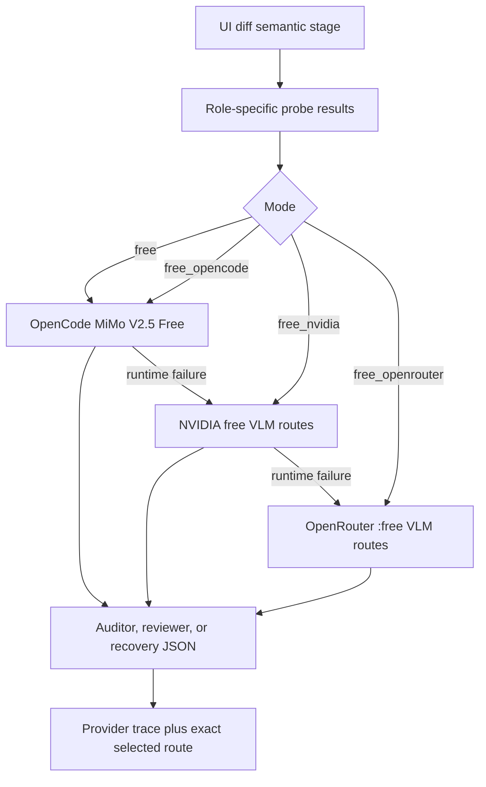

# OpenCode Provider And Report Truth Design

**Status:** proposed for implementation review

**Purpose:** remove the current free-provider capacity blocker by adding OpenCode Zen's free image-capable route, while correcting the two remaining provider-independent report-integrity defects.

## Research Result

Research was performed against OpenCode `1.17.9`, its published OpenAPI document, the official OpenCode Server, SDK, Zen, and model documentation, and live requests on 2026-06-23.

- `opencode serve` exposes an OpenAPI 3.1 document at `/doc`, but running a local OpenCode daemon is unnecessary for this product.
- OpenCode Zen exposes an OpenAI-compatible endpoint at `https://opencode.ai/zen/v1/chat/completions`.
- The installed and live model catalogs list `mimo-v2.5-free` and `deepseek-v4-flash-free` as free routes.
- OpenCode model metadata marks `mimo-v2.5-free` as image-capable and `deepseek-v4-flash-free` as text-only.
- A direct live MiMo request accepted a PNG and returned schema-valid JSON.
- A second direct live MiMo request accepted five distinct PNGs and correctly returned `imageCount: 5` and `hasBlueImage: true`.
- OpenCode's official Zen documentation says the free models are available for a limited time. Runtime probes therefore remain mandatory; the route must never be assumed healthy from its catalog entry alone.

Sources:

- [OpenCode Server](https://opencode.ai/docs/server/)
- [OpenCode SDK](https://opencode.ai/docs/sdk/)
- [OpenCode Zen](https://opencode.ai/docs/zen/)
- [OpenCode Models](https://opencode.ai/docs/models/)

## Architecture Decision

Use the direct OpenCode Zen API as a third provider adapter.

Do not invoke `opencode run` per model call and do not require `opencode serve`. Both approaches wrap inference in agent/session machinery that the UI-diff pipeline does not need. The direct API preserves the existing `VisionJsonCaller` boundary, accepts the same ordered image payload, and keeps provider routing observable in the existing trace.

`opencode/mimo-v2.5-free` is eligible for auditor, reviewer, and target-recovery roles. `opencode/deepseek-v4-flash-free` is not eligible because all three roles require crop images. It may be reconsidered only if a future role is explicitly text-only.

Diagram source: `docs/architecture/diagrams/opencode-provider-flow.mmd`.

## Provider Contract

- Provider ID: `opencode`.
- Model route ID: `mimo-v2.5-free`.
- Default base URL: `https://opencode.ai/zen/v1`.
- Optional override: `OPENCODE_ZEN_BASE_URL`.
- Optional credential: `OPENCODE_API_KEY`. The adapter resolves an explicit argument first, then `OPENCODE_API_KEY`, then the current public free-route credential value `public`; no secret is required for the current free endpoint.
- Request shape: OpenAI-compatible messages with prompt text first and ordered `image_url` data URLs after it.
- Structured output: request `response_format.json_schema`; still parse and validate the returned text locally because provider compliance is never trusted implicitly.
- The adapter records the route provider/model in selection metadata and the provider-returned concrete model in call results.
- HTTP errors, empty content, malformed JSON, truncated JSON, and schema-invalid output remain visible through provider diagnostics and fallback tracing.

## Selection And Probe Policy

- Add `free_opencode` as an explicit provider-isolation mode.
- Change default `free` provider order to OpenCode, NVIDIA, then OpenRouter.
- Preserve `free_nvidia`, `free_openrouter`, `paid`, and `deterministic_only` behavior.
- Paid routes remain impossible unless both `mode: paid` and `UI_DIFF_ENABLE_PAID_MODE=1` are present.
- Probe each unique provider/model route once at the maximum image count required by its requested roles. Reuse that result for lower-image-count roles in the same run. A five-image pass satisfies the four-image recovery probe.
- Build auditor, reviewer, and target-recovery fallback lists from passing role-specific probe records. OpenCode MiMo is first in default `free`; other providers remain available after it.
- Keep reviewer independence as a preference, not a reason to select a known weaker route. If no other strong passing visual route exists, MiMo may review MiMo's audit output; the exact duplicate route remains explicit in `modelSelection`.

## Report Truth Fixes

### Comparison-space artifact

`actual-comparison-space.png` is a real run artifact used by pixel and overlay comparisons. Add a dedicated `actual_comparison_space` artifact role and include it in `runArtifacts`, so `artifacts/index.json` indexes every primary comparison image.

### Stage lifecycle versus semantic outcome

The current stage `status: complete` means only that the function returned. That is misleading when audit routes exhaust or recovery stops at a deadline.

Keep `status` as execution lifecycle and add an explicit semantic `outcome`:

- `success`: the stage completed its required semantic work.
- `incomplete`: the stage ran but left required work unresolved.
- `unavailable`: the stage could not perform semantic work because no route/caller was available.
- `not_applicable`: the stage was intentionally skipped, such as provider stages in deterministic-only mode or recovery with no uncovered regions.

The fixed provider-stage set is `model_probe`, `audit`, and `target_recovery`. Every final report contains all three. Their detail names the terminal reason from `auditScope` or `recoverySummary`; a trace explains the provider event but never converts an incomplete outcome into success.

Legacy stage records without `outcome` parse fail-closed: `skipped` becomes `not_applicable`; every other missing outcome becomes `incomplete`. New checkpoints always write an explicit outcome.

## Error And Release Semantics

- An OpenCode catalog entry without a passing image/schema probe is not selectable.
- A runtime OpenCode failure triggers the existing typed fallback route, with `provider: opencode` in trace events.
- A full run is production-successful only when `visualClassificationStatus === complete`, `auditLimited === false`, audit accounting has no failed or remaining pairs, recovery leaves zero unresolved regions, and provider stages have `outcome: success` or `not_applicable` as appropriate.
- Diagnostic gates may still record incomplete runs, but the strict Calorix release gate must fail them.

## Verification

- Unit tests cover request shape, public-key default, schema parsing, HTTP diagnostics, provider selection, probe deduplication, artifact indexing, and stage outcomes.
- Integration/e2e tests assert exact OpenCode route metadata and fixed stage records in the final report.
- `verify:opencode-live` performs real one-image and five-image structured probes without a sidecar.
- The final validation sequence runs deterministic verification, OpenCode live, the default MCP live gate, bounded/full Calorix diagnostics, and the strict Calorix release gate.
